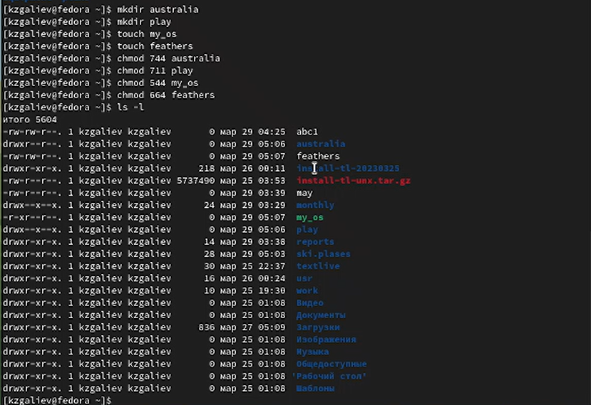

---
## Front matter
title: "Лабораторная работа №6"
subtitle: "Дисциплина: Операционные системы"
author: "Галиев Казиз Жарылкасымович"

## Generic otions
lang: ru-RU
toc-title: "Содержание"

## Bibliography
bibliography: bib/cite.bib
csl: pandoc/csl/gost-r-7-0-5-2008-numeric.csl

## Pdf output format
toc: true # Table of contents
toc-depth: 2
lof: true # List of figures
lot: true # List of tables
fontsize: 12pt
linestretch: 1.5
papersize: a4
documentclass: scrreprt
## I18n polyglossia
polyglossia-lang:
  name: russian
  options:
	- spelling=modern
	- babelshorthands=true
polyglossia-otherlangs:
  name: english
## I18n babel
babel-lang: russian
babel-otherlangs: english
## Fonts
mainfont: PT Serif
romanfont: PT Serif
sansfont: PT Sans
monofont: PT Mono
mainfontoptions: Ligatures=TeX
romanfontoptions: Ligatures=TeX
sansfontoptions: Ligatures=TeX,Scale=MatchLowercase
monofontoptions: Scale=MatchLowercase,Scale=0.9
## Biblatex
biblatex: true
biblio-style: "gost-numeric"
biblatexoptions:
  - parentracker=true
  - backend=biber
  - hyperref=auto
  - language=auto
  - autolang=other*
  - citestyle=gost-numeric
## Pandoc-crossref LaTeX customization
figureTitle: "Рис."
tableTitle: "Таблица"
listingTitle: "Листинг"
lofTitle: "Список иллюстраций"
lotTitle: "Список таблиц"
lolTitle: "Листинги"
## Misc options
indent: true
header-includes:
  - \usepackage{indentfirst}
  - \usepackage{float} # keep figures where there are in the text
  - \floatplacement{figure}{H} # keep figures where there are in the text
---

# Цель работы

 Ознакомление с файловой системой Linux, её структурой, именами и содержа-
нием каталогов. Приобретение практических навыков по применению команд для
работы с файлами и каталогами, по управлению процессами (и работами), по про-
верке использования диска и обслуживанию файловой системы.

# Выполнение лабораторной работы

 1. Выполните все примеры, приведённые в первой части описания лабораторной
работы (рис. @fig:001).

{#fig:001 width=70%}

2. Скопируйте файл /usr/include/sys/io.h в домашний каталог и назовите
его equipment (рис. @fig:002).

{#fig:002 width=70%}

3. В домашнем каталоге создайте директорию ~/ski.plases (рис. @fig:003).

{#fig:003 width=70%}

4. Переместите файл equipment в каталог ~/ski.plases (рис. @fig:004).

{#fig:004 width=70%}

5. Переименуйте файл ~/ski.plases/equipment в ~/ski.plases/equiplist (рис @fig:006).

{#fig:006 width=70%}

6. Создайте в домашнем каталоге файл abc1 и скопируйте его в каталог ~/ski.plases, назовите его equiplist2 (рис @fig:007).

{#fig:007 width=70%}

7. Создайте каталог с именем equipment в каталоге ~/ski.plases (рис @fig:008).

{#fig:008 width=70%}

8.  Переместите файлы ~/ski.plases/equiplist и equiplist2 в каталог ~/ski.plases/equipment (рис @fig:009).

{#fig:009 width=70%}

9.  Создайте и переместите каталог ~/newdir в каталог ~/ski.plases и назовите его plans (рис @fig:0010)

{#fig:0010 width=70%}

10. Определите опции команды chmod, необходимые для того, чтобы присвоить перечисленным ниже файлам выделенные права доступа, считая, что в начале таких прав нет (рис @fig:011)

{#fig:011 width=70%}

11. Просмотрите содержимое файла /etc/password (рис @fig:012)

{#fig:012 width=70%}

12. Скопируйте файл ~/feathers в файл ~/file.old (рис @fig:013).

{#fig:013 width=70%}

13. Переместите файл ~/file.old в каталог ~/play (рис @fig:014).

{#fig:014 width=70%}

14. Скопируйте каталог ~/play в каталог ~/fun (рис @fig:015).

{#fig:015 width=70%}

15. Переместите каталог ~/fun в каталог ~/play и назовите его games (рис @fig:016).

{#fig:016 width=70%}

16. Лишите владельца файла ~/feathers права на чтение (рис @fig:017).

{#fig:017 width=70%}

17. Что произойдёт, если вы попытаетесь просмотреть файл ~/feathers командой cat? (рис @fig:018).

{#fig:018 width=70%}

18.  Что произойдёт, если вы попытаетесь скопировать файл ~/feathers? (рис @fig:019)

{#fig:019 width=70%}

19. Дайте владельцу файла ~/feathers право на чтение (рис @fig:020).

{#fig:020 width=70%}

20. Лишите владельца каталога ~/play права на выполнение (рис @fig:021).

{#fig:021 width=70%}

21. Перейдите в каталог ~/play. Что произошло? (рис @fig:022)

{#fig:022 width=70%}

22. Дайте владельцу каталога ~/play право на выполнение (рис @fig:023)

{#fig:023 width=70%}

#Контрольные вопросы

1.	Дайте характеристику каждой файловой системе, существующей на жёстком диске компьютера, на котором вы выполняли лабораторную работу. 

Для просмотра используемых в операционной системе файловых систем можно воспользоваться командой mount без параметров.В данном случае указаны имена устройств, названия соответствующих им точек монтирования (путь), тип файловой системы и параметрs монтирования. В контексте команды mount устройство — специальный файл устройства, с помощью которого операционная система получает доступ к аппаратному устройству. Файлы устройств обычно располагаются в каталоге /dev, имеют сокращённые имена.
Другой способ определения смонтированных в операционной системе файловых систем — просмотр файла/etc/fstab.
В каждой строке этого файла указано: – имя устройство; – точка монтирования; – тип файловой системы; – опции монтирования; – специальные флаги для утилиты dump; – порядок проверки целостности файловой системы с помощью утилиты fsck

2.	Приведите общую структуру файловой системы и дайте характеристику каждой директории первого уровня этой структуры. 
/ — root каталог. Содержит в себе всю иерархию системы;
/bin — здесь находятся двоичные исполняемые файлы. Основные общие команды, хранящиеся отдельно от других программ в системе (прим.: pwd, ls, cat, ps);
/boot — тут расположены файлы, используемые для загрузки системы (образ initrd, ядро vmlinuz);
/dev — в данной директории располагаются файлы устройств (драйверов). С помощью этих файлов можно взаимодействовать с устройствами. К примеру, если это жесткий диск, можно подключить его к файловой системе. В файл принтера же можно написать напрямую и отправить задание на печать;
/etc — в этой директории находятся файлы конфигураций программ. Эти файлы позволяют настраивать системы, сервисы, скрипты системных демонов;
/home — каталог, аналогичный каталогу Users в Windows. Содержит домашние каталоги учетных записей пользователей (кроме root). При создании нового пользователя здесь создается одноименный каталог с аналогичным именем и хранит личные файлы этого пользователя;
/lib — содержит системные библиотеки, с которыми работают программы и модули ядра;
/lost+found — содержит файлы, восстановленные после сбоя работы системы. Система проведет проверку после сбоя и найденные файлы можно будет посмотреть в данном каталоге;
/media — точка монтирования внешних носителей. Например, когда вы вставляете диск в дисковод, он будет автоматически смонтирован в директорию /media/cdrom;
/mnt — точка временного монтирования. Файловые системы подключаемых устройств обычно монтируются в этот каталог для временного использования;
/opt — тут расположены дополнительные (необязательные) приложения. Такие программы обычно не подчиняются принятой иерархии и хранят свои файлы в одном подкаталоге (бинарные, библиотеки, конфигурации);
/proc — содержит файлы, хранящие информацию о запущенных процессах и о состоянии ядра ОС;
/root — директория, которая содержит файлы и личные настройки суперпользователя;
/run — содержит файлы состояния приложений. Например, PID-файлы или UNIX-сокеты;
/sbin — аналогично /bin содержит бинарные файлы. Утилиты нужны для настройки и администрирования системы суперпользователем;
/srv — содержит файлы сервисов, предоставляемых сервером (прим. FTP или Apache HTTP);
/sys — содержит данные непосредственно о системе. Тут можно узнать информацию о ядре, драйверах и устройствах;
/tmp — содержит временные файлы. Данные файлы доступны всем пользователям на чтение и запись. Стоит отметить, что данный каталог очищается при перезагрузке;
/usr — содержит пользовательские приложения и утилиты второго уровня, используемые пользователями, а не системой. Содержимое доступно только для чтения (кроме root). Каталог имеет вторичную иерархию и похож на корневой;
/var — содержит переменные файлы. Имеет подкаталоги, отвечающие за отдельные переменные. Например, логи будут храниться в /var/log, кэш в /var/cache, очереди заданий в /var/spool/ и так далее.

3.	Какая операция должна быть выполнена, чтобы содержимое некоторой файловой системы было доступно операционной системе? 

Монтирование. Команда mount

4.	Назовите основные причины нарушения целостности файловой системы. Как устранить повреждения файловой системы? 

Отсутствие синхронизации между образом файловой системы в памяти и ее данными на диске в случае аварийного останова может привести к появлению следующих ошибок:
- Один блок адресуется несколькими mode (принадлежит нескольким файлам).
- Блок помечен как свободный, но в то же время занят (на него ссылается onode).
- Блок помечен как занятый, но в то же время свободен (ни один inode на него не ссылается).
- Неправильное число ссылок в inode (недостаток или избыток ссылающихся записей в каталогах).
- Несовпадение между размером файла и суммарным размером адресуемых inode блоков.
- Недопустимые адресуемые блоки (например, расположенные за пределами файловой системы).
- "Потерянные" файлы (правильные inode, на которые не ссылаются записи каталогов).
- Недопустимые или неразмещенные номера inode в записях каталогов.

5.	Как создаётся файловая система? 

mkfs - позволяет создать файловую систему Linux.

6.	Дайте характеристику командам, которые позволяют просмотреть текстовые файлы. 

Cat - выводит содержимое файла на стандартное устройство вывода

7.	Приведите основные возможности команды cp в Linux. 

Cp – копирует или перемещает директорию, файлы.

8.	Назовите и дайте характеристику командам перемещения и переименования файлов и каталогов. 

Команды mv и mvdir предназначены для перемещения и переименования файлов и каталогов. Формат команды mv: mv [-опции] старый_файл новый_файл

9. Что такое права доступа? Как они могут быть изменены? При ответах на вопросы используйте дополнительные источники информации по теме.

Права доступа к файлу или каталогу можно изменить, воспользовавшись командой chmod. Сделать это может владелец файла (или каталога) или пользователь с правами администратора.

# Выводы

 В результате лабораторной работы я ознакомился с файловой системой Linux, ее структурой, именами и содержанием каталогов, приобрел практические навыки по применению команд для работы с файлами и каталогами, по управлению процессами, по проверке использования диска и обслуживанию файловой системы.

# Список литературы{.unnumbered}

::: {#refs}
:::
