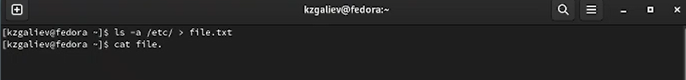
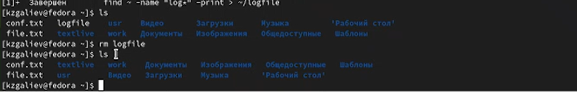
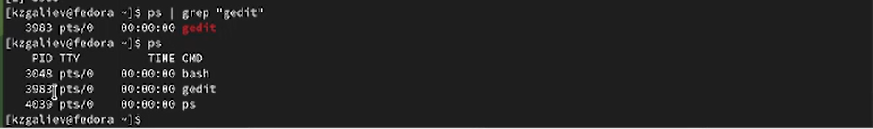
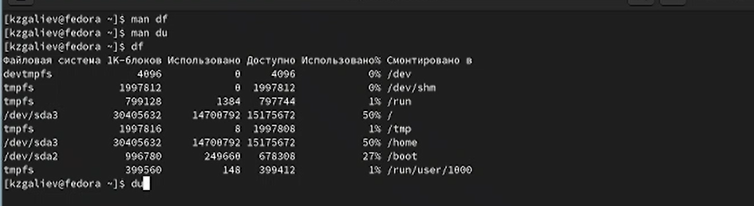

---
## Front matter
title: "Лабораторная работа №7"
subtitle: "Дисциплина: Операционные системы "
author: "Галиев Казиз Жарылкасымович"

## Generic otions
lang: ru-RU
toc-title: "Содержание"

## Bibliography
bibliography: bib/cite.bib
csl: pandoc/csl/gost-r-7-0-5-2008-numeric.csl

## Pdf output format
toc: true # Table of contents
toc-depth: 2
lof: true # List of figures
lot: true # List of tables
fontsize: 12pt
linestretch: 1.5
papersize: a4
documentclass: scrreprt
## I18n polyglossia
polyglossia-lang:
  name: russian
  options:
	- spelling=modern
	- babelshorthands=true
polyglossia-otherlangs:
  name: english
## I18n babel
babel-lang: russian
babel-otherlangs: english
## Fonts
mainfont: PT Serif
romanfont: PT Serif
sansfont: PT Sans
monofont: PT Mono
mainfontoptions: Ligatures=TeX
romanfontoptions: Ligatures=TeX
sansfontoptions: Ligatures=TeX,Scale=MatchLowercase
monofontoptions: Scale=MatchLowercase,Scale=0.9
## Biblatex
biblatex: true
biblio-style: "gost-numeric"
biblatexoptions:
  - parentracker=true
  - backend=biber
  - hyperref=auto
  - language=auto
  - autolang=other*
  - citestyle=gost-numeric
## Pandoc-crossref LaTeX customization
figureTitle: "Рис."
tableTitle: "Таблица"
listingTitle: "Листинг"
lofTitle: "Список иллюстраций"
lotTitle: "Список таблиц"
lolTitle: "Листинги"
## Misc options
indent: true
header-includes:
  - \usepackage{indentfirst}
  - \usepackage{float} # keep figures where there are in the text
  - \floatplacement{figure}{H} # keep figures where there are in the text
---

# Цель работы

Ознакомление с инструментами поиска файлов и фильтрации текстовых данных. Приобретение практических навыков: по управлению процессами (и заданиями), по проверке использования диска и обслуживанию файловых систем.

# Выполнение лабораторной работы

1. Запишите в файл file.txt названия файлов, содержащихся в каталоге /etc. (рис. @fig:001).

{#fig:001 width=70%}

Допишите в этот же файл названия файлов, содержащихся в вашем домашнем каталоге (рис. @fig:002).

{#fig:002 width=70%}

2. Выведите имена всех файлов из file.txt, имеющих расширение .conf, после чего запишите их в новый текстовой файл conf.txt (рис. @fig:003).

{#fig:003 width=70%}

3. Определите, какие файлы в вашем домашнем каталоге имеют имена, начинавшиеся с символа c? Предложите несколько вариантов, как это сделать (рис. @fig:004).

{#fig:004 width=70%}

4. Выведите на экран (по странично) имена файлов из каталога /etc, начинающиеся с символа h (рис. @fig:005).

{#fig:005 width=70%}

5. Запустите в фоновом режиме процесс, который будет записывать в файл ~/logfile файлы, имена которых начинаются с log (рис. @fig:006).

{#fig:006 width=70%}

6. Удалите файл ~/logfile (рис. @fig:007).

{#fig:007 width=70%}

7. Запустите из консоли в фоновом режиме редактор gedit (рис. @fig:008).

{#fig:008 width=70%}

8. Определите идентификатор процесса gedit, используя команду ps, конвейер и фильтр grep (рис. @fig:009).

{#fig:009 width=70%}

9. Прочтите справку (man) команды kill, после чего используйте её для завершения процесса gedit (рис. @fig:010).

{#fig:010 width=70%}

10. Выполните команды df и du, предварительно получив более подробную информацию об этих командах, с помощью команды man (рис. @fig:011).

{#fig:011 width=70%}

11. Воспользовавшись справкой команды find, выведите имена всех директорий, имеющихся в вашем домашнем каталоге (рис. @fig:012).

{#fig:012 width=70%}

# Контрольные вопросы

1. Какие потоки ввода вывода вы знаете? 

– stdin — стандартный поток ввода (по умолчанию: клавиатура), файловый дескриптор 0; 
– stdout — стандартный поток вывода (по умолчанию: консоль), файловый дескриптор 1; 
– stderr — стандартный поток вывод сообщений об ошибках (по умолчанию: консоль), файловый дескриптор 2. 

2. Объясните разницу между операцией > и >>. 

Оба оператора являются операторами направления вывода. Основное отличие указано ниже:
> : Перезаписывает существующий файл или создает файл, если файл с указанным именем отсутствует в каталоге.
>> : добавляет в существующий файл или создает файл, если файл с указанным именем отсутствует в каталоге.

3. Что такое конвейер? 

Конвейер (pipe) служит для объединения простых команд или утилит в цепочки, в которых результат работа предыдущей команды передаётся последующей.

4. Что такое процесс? Чем это понятие отличается от программы? 

Процесс, в простейших терминах, — это выполняющаяся программа. Один или несколько потоков выполняются в контексте процесса. 
Компьютерная программа сама по себе — лишь пассивная последовательность инструкций. В то время как процесс — непосредственное выполнение этих инструкций.

5. Что такое PID и GID? 

Все процессы система регистрирует в таблице процессов, присваивая каждому уникальный номер — идентификатор процесса (process identificator, PID).
GID — идентификатор группы, которой принадлежит файл, тип объекта и набор т. н. атрибутов, а также некоторая дополнительная информация.

6. Что такое задачи и какая команда позволяет ими управлять? 

Запущенные фоном программы называются задачами. Команда jobs.

7. Найдите информацию об утилитах top и htop. Каковы их функции? 

top (table of processes) — консольная команда, которая выводит список работающих в системе процессов и информацию о них. По умолчанию она в реальном времени сортирует их по нагрузке на процессор, позволяет просматривать процессы, запущенные от имени одного пользователя (клавиша u ); может выводить процессы в виде дерева (клавиша t ) (аналог функциональности утилиты pstree); может показывать потоки процессов пользователя (клавиша H ) и потоки ядра (клавиша K ).
htop — компьютерная программа, предназначенная для вывода на терминал списка запущенных процессов и информации о них (монитор процессов). Создана как альтернатива программы top. Написана на языке Си. Предоставляет пользователю текстовый интерфейс; для вывода на терминал использует библиотеку ncurses.

8. Назовите и дайте характеристику команде поиска файлов. Приведите примеры использования этой команды. 

Команда find используется для поиска и отображения имён файлов, соответствующих заданной строке символов. Формат команды: find путь [-опции] Путь определяет каталог, начиная с которого по всем подкаталогам будет вестись поиск. 

9. Можно ли по контексту (содержанию) найти файл? Если да, то как? 

Для поиска файла по содержимому проще всего воспользоваться командой grep (вместо find). Вы можете указать grep выводить только имя файла, в котором было найдено заданное слово с помощью опции -l. Например, следующая команда выведет все имена файлов, при поиске по содержимому которых было обнаружено вхождение primary:
grep -l 'primary' *.c

10. Как определить объем свободной памяти на жёстком диске?

Команда df — сокращенное «disk-free», показывает доступное и используемое дисковое пространство в системе Linux.
 
11. Как определить объем вашего домашнего каталога? 

Для того, чтобы узнать общий размер, который занимает определенная папка вызовите команду du с ключем -s.

12. Как удалить зависший процесс?

Для завершения процесса нужно вызвать утилиту kill с параметром "-9". В этом случае она просто убьет процесс без процедуры "завершитесь, пожалуйста" (123 - ID процесса). Также можно использовать утилиту killall, когда необходимо убить дерево процессов.

# Выводы

В ходе выолнения лабораторной работы я ознакомился с инструментами поиска файлов и фильтрации текстовых данных. Приобрел практические навыки: по уравлению процессами (и заданиями), по проверке использования диска и обслуживанию файловых систем.

# Список литературы{.unnumbered}

::: {#refs}
:::
