---
## Front matter
title: "Лабораторная работа №9"
subtitle: "Дисциплина: Операционные системы"
author: "Галиев Казиз Жарылкасымович"

## Generic otions
lang: ru-RU
toc-title: "Содержание"

## Bibliography
bibliography: bib/cite.bib
csl: pandoc/csl/gost-r-7-0-5-2008-numeric.csl

## Pdf output format
toc: true # Table of contents
toc-depth: 2
lof: true # List of figures
lot: true # List of tables
fontsize: 12pt
linestretch: 1.5
papersize: a4
documentclass: scrreprt
## I18n polyglossia
polyglossia-lang:
  name: russian
  options:
	- spelling=modern
	- babelshorthands=true
polyglossia-otherlangs:
  name: english
## I18n babel
babel-lang: russian
babel-otherlangs: english
## Fonts
mainfont: PT Serif
romanfont: PT Serif
sansfont: PT Sans
monofont: PT Mono
mainfontoptions: Ligatures=TeX
romanfontoptions: Ligatures=TeX
sansfontoptions: Ligatures=TeX,Scale=MatchLowercase
monofontoptions: Scale=MatchLowercase,Scale=0.9
## Biblatex
biblatex: true
biblio-style: "gost-numeric"
biblatexoptions:
  - parentracker=true
  - backend=biber
  - hyperref=auto
  - language=auto
  - autolang=other*
  - citestyle=gost-numeric
## Pandoc-crossref LaTeX customization
figureTitle: "Рис."
tableTitle: "Таблица"
listingTitle: "Листинг"
lofTitle: "Список иллюстраций"
lotTitle: "Список таблиц"
lolTitle: "Листинги"
## Misc options
indent: true
header-includes:
  - \usepackage{indentfirst}
  - \usepackage{float} # keep figures where there are in the text
  - \floatplacement{figure}{H} # keep figures where there are in the text
---

# Цель работы

Познакомиться с операционной системой Linux. Получить практические навыки работы с редактором vi, установленным по умолчанию практически во всех дистрибутивах.

# Выполнение лабораторной работы

1. Создайте каталог с именем ~/work/os/lab06 (рис. @fig:001).

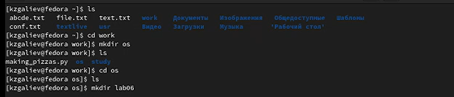{#fig:001 width=70%}

2. Перейдите во вновь созданный каталог (рис. @fig:002).

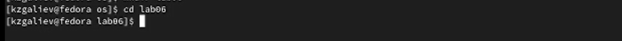{#fig:002 width=70%}

3. Вызовите vi и создайте файл hello.sh (рис. @fig:003).

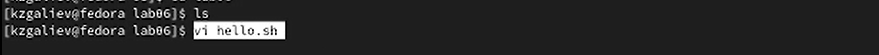{#fig:003 width=70%}

4. Нажмите клавишу i и вводите текст (рис. @fig:004).

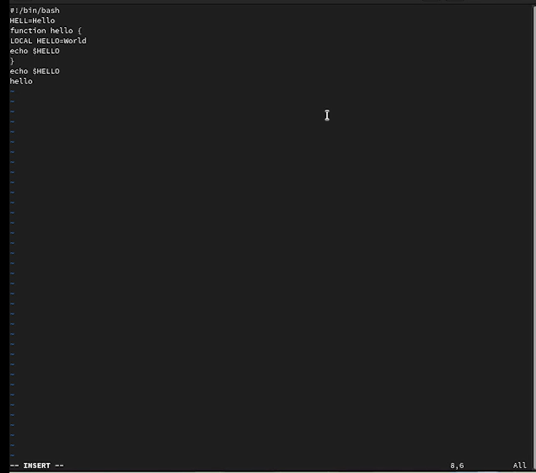{#fig:004 width=70%}

5. Нажмите клавишу Esc для перехода в командный режим после завершения ввода текста (рис. @fig:005).

{#fig:005 width=70%}

6. Нажмите : для перехода в режим последней строки и внизу вашего экрана появится приглашение в виде двоеточия (рис. @fig:006).

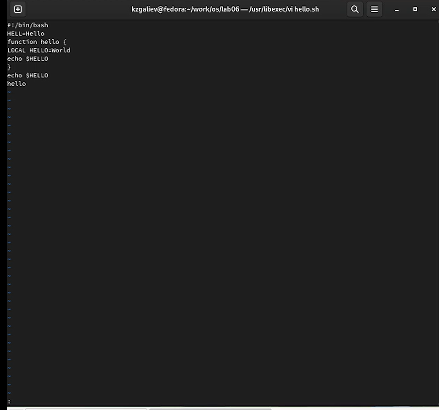{#fig:006 width=70%}

7. Нажмите w (записать) и q (выйти), а затем нажмите клавишу Enter для сохранения вашего текста и завершения работы (рис. @fig:007).

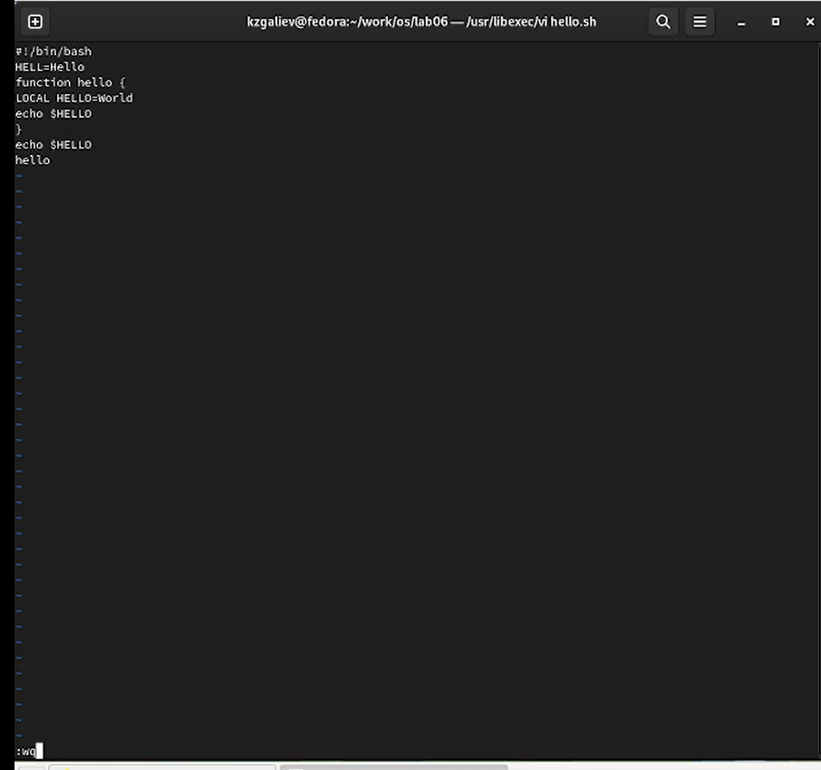{#fig:007 width=70%}

8. Сделайте файл исполняемым (рис. @fig:008).
chmod +x hello.sh

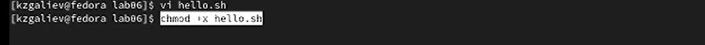{#fig:008 width=70%}

9. Вызовите vi на редактирование файла (рис. @fig:009).

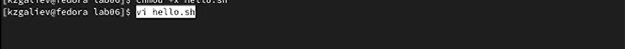{#fig:009 width=70%}

10. Установите курсор в конец слова HELL второй строки (рис. @fig:010).
Для этого набираем 2G, потом w.

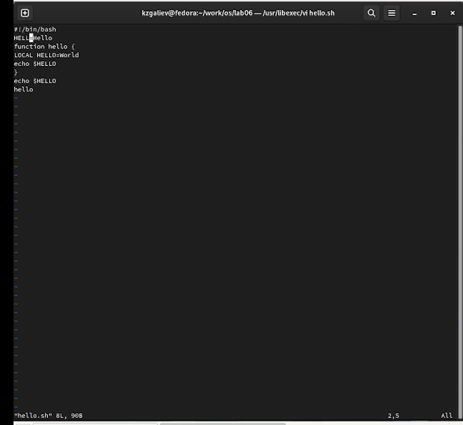{#fig:010 width=70%}

11. Перейдите в режим вставки и замените на HELLO. Нажмите Esc для возврата в командный режим
 (рис. @fig:011). Режим вставки - это буква i.
 
 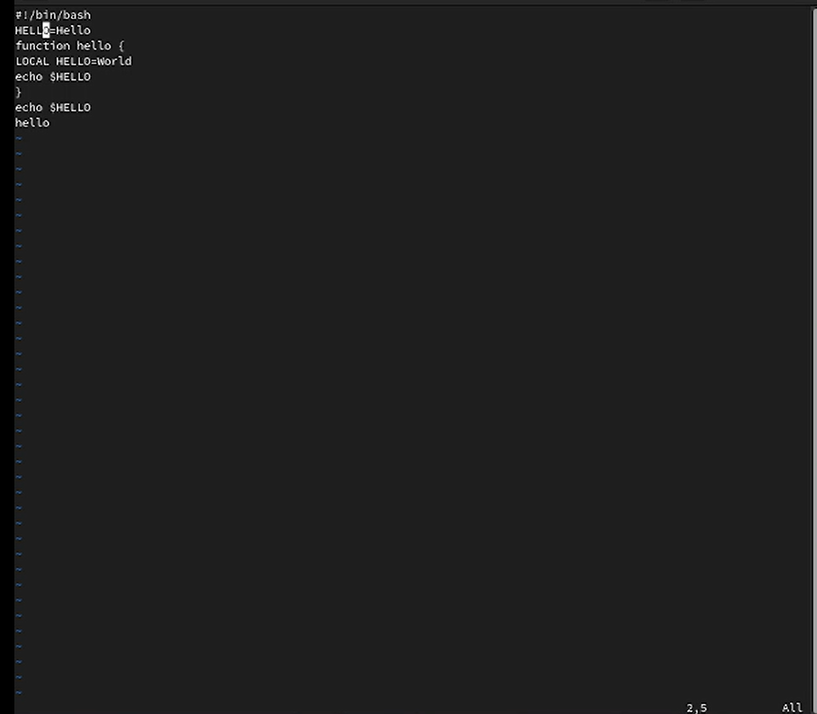{#fig:011 width=70%}
 
 12. Установите курсор на четвертую строку и сотрите слово LOCAL. Для этого набираем 4G, потом dw 
 (рис. @fig:012).
 
 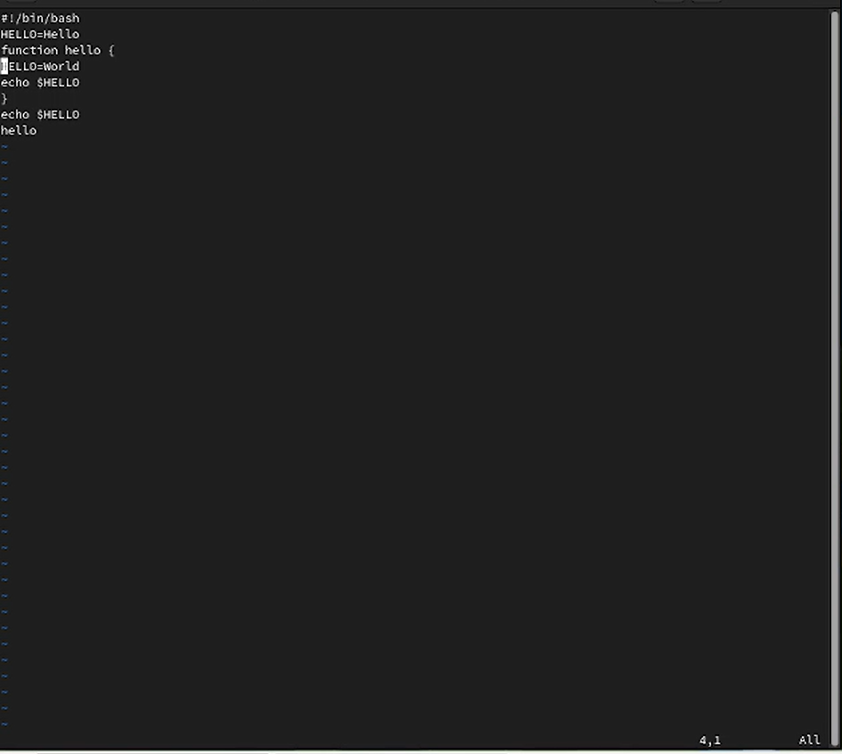{#fig:012 width=70%}
 
 13. Перейдите в режим вставки и наберите следующий текст: local, нажмите Esc для возврата в командный режим. Режим вставки - клавиша i (рис. @fig:013).
 
 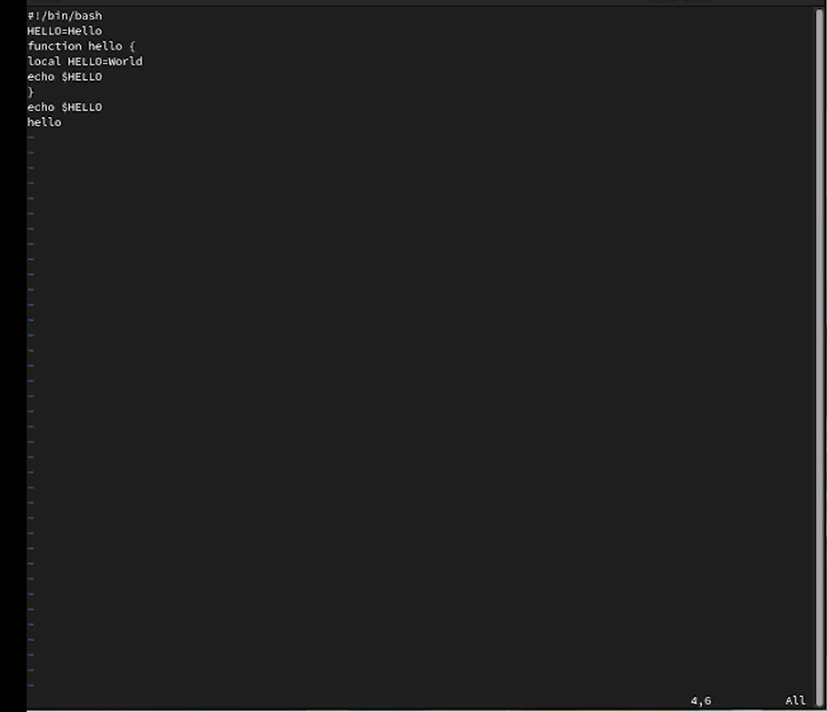{#fig:013 width=70%}
 
 14. Установите курсор на последней строке файла. Вставьте после неё строку, содержащую следующий текст: echo $HELLO. Для перехода а последнюю строку нажимаем G. Потом нажимаем o и набираем текст
 (рис. @fig:014).
 
 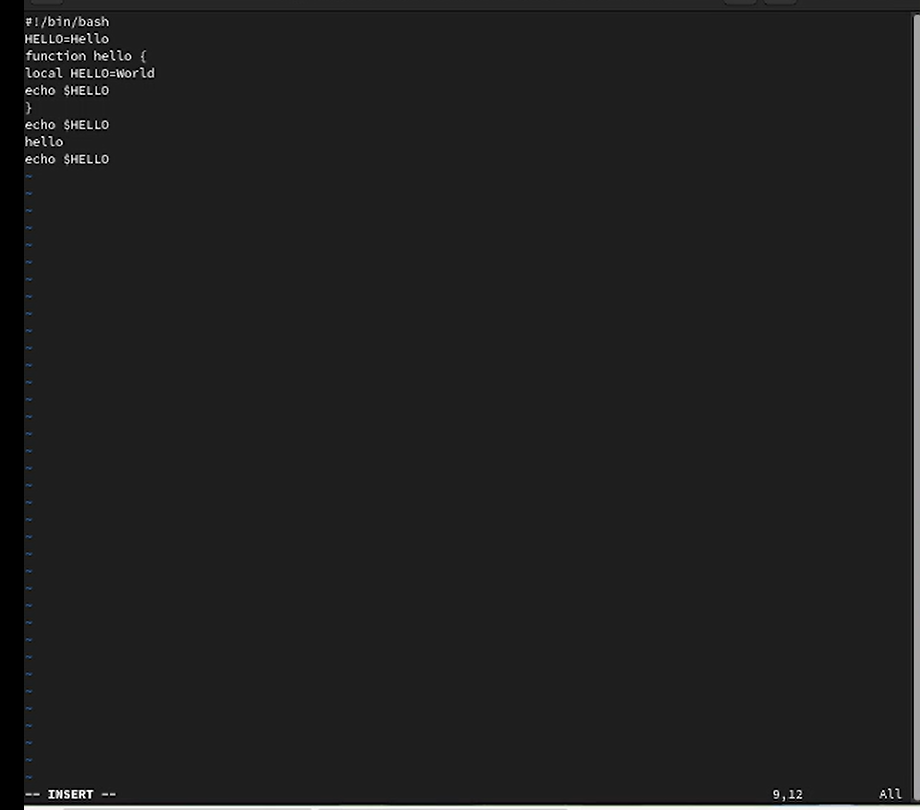{#fig:014 width=70%}
 
 15. Нажмите Esc для перехода в командный режим (рис. @fig:015).
 
 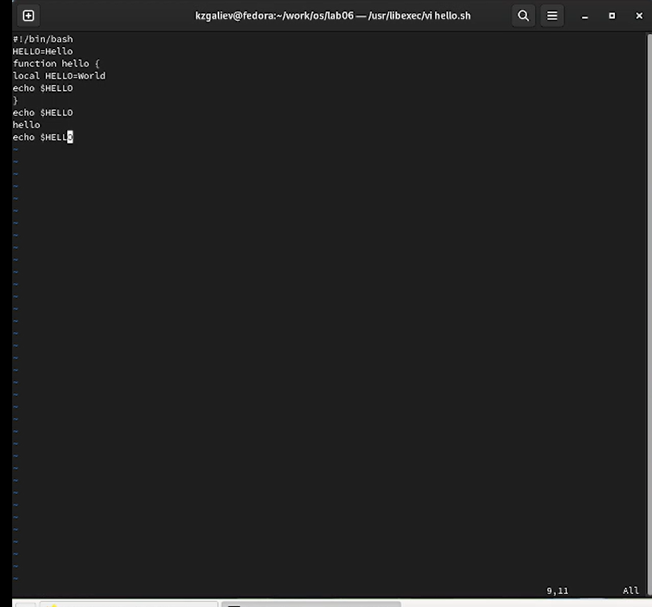{#fig:015 width=70%}
 
 16. Удалите последнюю строку. Для этого нажимаем dd (рис. @fig:016).
 
 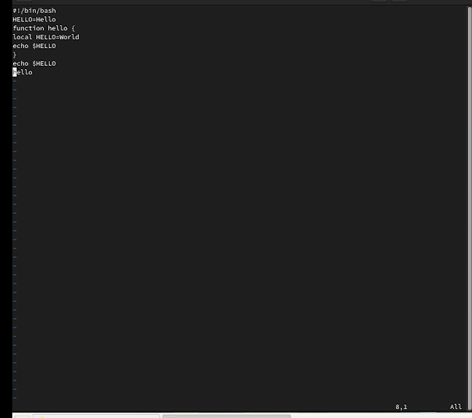{#fig:016 width=70%}
 
 17. Введите команду отмены изменений u для отмены последней команды (рис. @fig:017).
 
 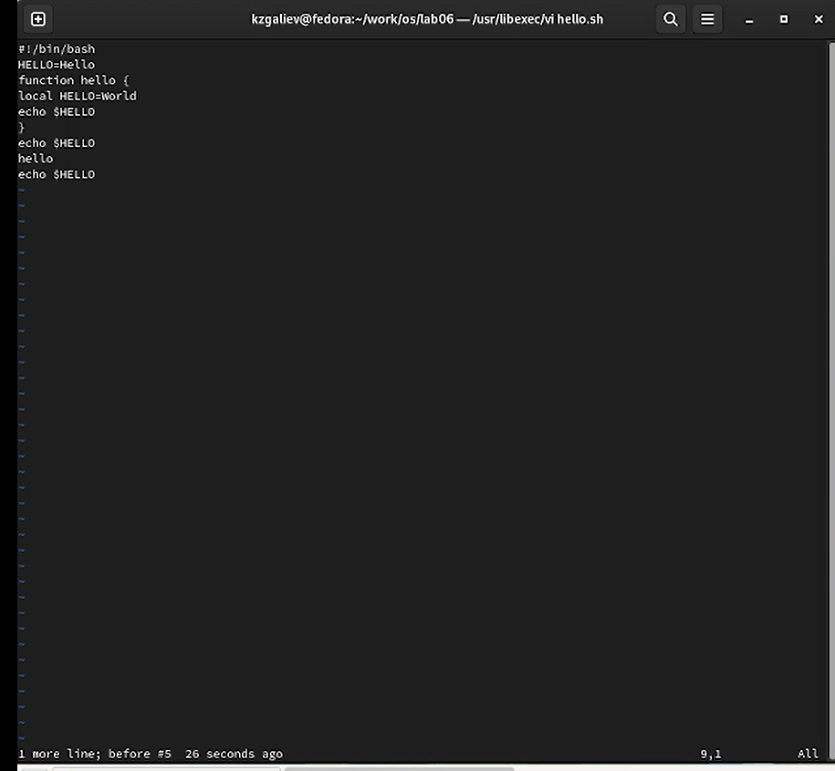{#fig:017 width=70%}
 
 18. Введите символ : для перехода в режим последней строки. Запишите произведённые изменения и выйдите из vi. Для этого нажимаем wq и Enter (рис. @fig:018).
 
 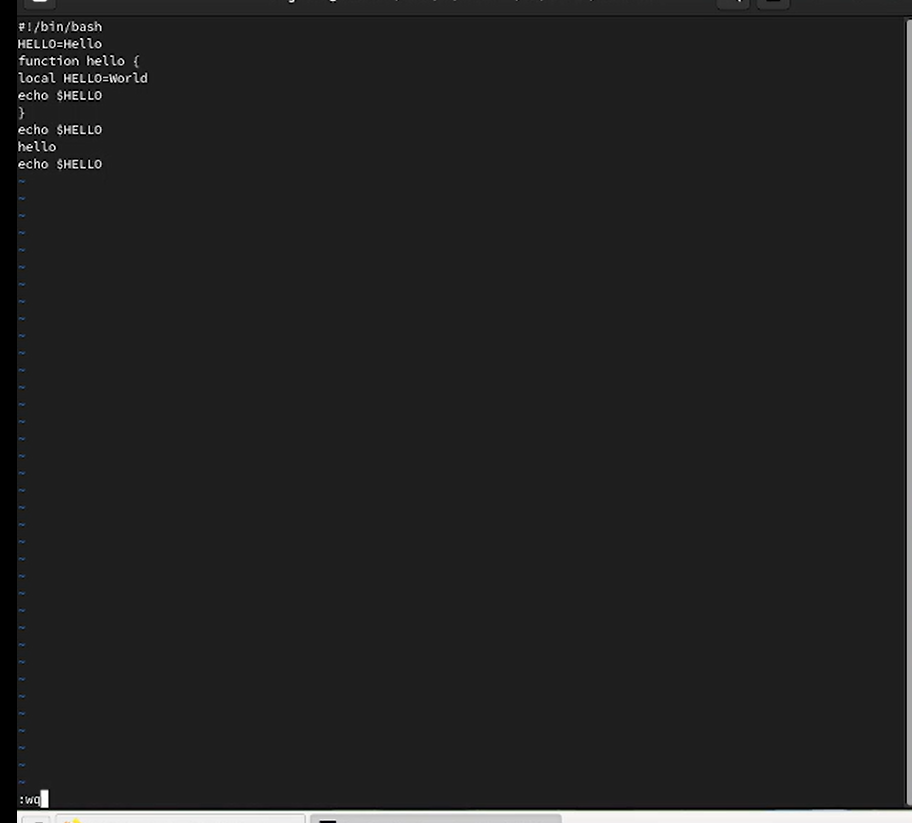{#fig:018 width=70%}

# Выводы

В ходе выполнения абораторной работы я познакомился с операционной системой Linux и получил практические навыки работы с редактором vi, установленным по умолчанию практически во всех дистрибутивах.

# Контрольные вопросы

1. Дайте краткую характеристику режимам работы редактора vi. 

Редактор vi имеет три режима работы: 
– командный режим — предназначен для ввода команд редактирования и навигации по редактируемому файлу; 
– режим вставки — предназначен для ввода содержания редактируемого файла; 
– режим последней (или командной) строки — используется для записи изменений в файл и выхода из редактора.

2. Как выйти из редактора, не сохраняя произведённые изменения? 

Переход в командный режим осуществляется нажатием клавиши Esc . Для выхода из редактора vi необходимо перейти в режим последней строки: находясь в командном режиме, нажать Shift-; (по сути символ : — двоеточие), затем: – набрать символ q (или q!), если требуется выйти из редактора без сохранения.

3. Назовите и дайте краткую характеристику командам позиционирования. 

– 0 (ноль) — переход в начало строки; 
– $ — переход в конец строки; 
– G — переход в конец файла; 
– n G — переход на строку с номером n.

4. Что для редактора vi является словом? 

Редактор vi предполагает, что слово - это строка символов, которая может включать в себя буквы, цифры и символы подчеркивания до разделителя. При использовании прописных W и B под разделителями понимаются только пробел, табуляция и возврат каретки. При использовании строчных w и b под разделителями понимаются также любые знаки пунктуации

5. Каким образом из любого места редактируемого файла перейти в начало (конец) файла? 

С помощью клавиши 
gg - перейти в начало файла 
– G — переход в конец файла;

6. Назовите и дайте краткую характеристику основным группам команд редактирования. 

Вставка текста
 – а — вставить текст после курсора; 
– А — вставить текст в конец строки; 
– i — вставить текст перед курсором; 
– n i — вставить текст n раз; 
– I — вставить текст в начало строки. 
Вставка строки 
– о — вставить строку под курсором; 
– О — вставить строку над курсором. 
 Удаление текста
 – x — удалить один символ в буфер;
 – d w — удалить одно слово в буфер; 
– d $ — удалить в буфер текст от курсора до конца строки;
 – d 0 — удалить в буфер текст от начала строки до позиции курсора;
– d d — удалить в буфер одну строку; 
– n d d — удалить в буфер n строк. 

7. Необходимо заполнить строку символами $. Каковы ваши действия?

Переходим в командный режим, нажав Esc. Набираем 80i . Попадаем в режим вставки. Потом набираем символ $ и нажимаем клавишу Esc.

 
8. Как отменить некорректное действие, связанное с процессом редактирования? 

– u — отменить последнее изменение; 
– : e ! — вернуться в командный режим, отменив все изменения, произведённые со времени последней записи. 

9. Назовите и дайте характеристику основным группам команд режима последней строки. 

Режим последней строки — это специальный режим, в котором редактору даются сложные команды. При вводе этих команд они отображаются в последней строке экрана (отсюда пошло название режима). 
Команды редактирования в режиме командной строки:
Копирование и перемещение текста
 – : n,m d — удалить строки с n по m;
 – : i,j m k — переместить строки с i по j, начиная со строки k;
 – : i,j t k — копировать строки с i по j в строку k; 
– : i,j w имя-файла — записать строки с i по j в файл с именем имя-файла. 
  Запись в файл и выход из редактора 
– : w — записать изменённый текст в файл, не выходя из vi; 
– : w имя-файла — записать изменённый текст в новый файл с именем имяфайла; 
– : w ! имя-файла — записать изменённый текст в файл с именем имяфайла; 
– : w q — записать изменения в файл и выйти из vi; 
– : q — выйти из редактора vi; 
– : q ! — выйти из редактора без записи; 
– : e ! — вернуться в командный режим, отменив все изменения, произведённые со времени последней записи. 

10. Как определить, не перемещая курсора, позицию, в которой заканчивается строка? 

– $ — переход в конец строки;

11. Выполните анализ опций редактора vi (сколько их, как узнать их назначение и т.д.). 

Опции редактора vi позволяют настроить рабочую среду. Для задания опций используется команда set (в режиме последней строки): 
– : set all — вывести полный список опций;
 – : set nu — вывести номера строк; 
– : set list — вывести невидимые символы; 
– : set ic — не учитывать при поиске, является ли символ прописным или строчным. Если вы хотите отказаться от использования опции, то в команде set перед именем опции надо поставить no. 

12. Как определить режим работы редактора vi? 
По умолчанию, работа начинается в командном режиме. В этом режиме можно перемещаться по файлу и выполнять некоторые «редактирующие» операции над текстом. Любое нажатие на клавиши в командном режиме воспринимается как команда. Возврат в командный режим из режима редактирования осуществляется нажатием клавиши <ESC>.
Для входа в режим вставки, который используется для ввода текста, нужно нажать клавишу i. Внизу появится надпись INSERT.
Для входа в режим последней строки необходимо нажать клавишу : . 
Внизу появится двоеточие.
Редактор vi имеет встроенный не экранный редактор, именуемый ex, который используется для некоторых операций редактирования, ориентированных на строки; управления файлами (сохранить, выйти, перечитать) и т.п.

# Список литературы{.unnumbered}

::: {#refs}
:::
