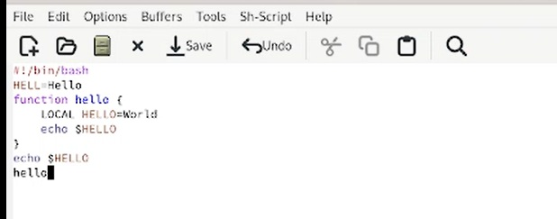

---
## Front matter
title: "Лабораторная работа №10"
subtitle: "Дисциплина: Операционные системы"
author: "Галиев Казиз Жарылкасымович"

## Generic otions
lang: ru-RU
toc-title: "Содержание"

## Bibliography
bibliography: bib/cite.bib
csl: pandoc/csl/gost-r-7-0-5-2008-numeric.csl

## Pdf output format
toc: true # Table of contents
toc-depth: 2
lof: true # List of figures
lot: true # List of tables
fontsize: 12pt
linestretch: 1.5
papersize: a4
documentclass: scrreprt
## I18n polyglossia
polyglossia-lang:
  name: russian
  options:
	- spelling=modern
	- babelshorthands=true
polyglossia-otherlangs:
  name: english
## I18n babel
babel-lang: russian
babel-otherlangs: english
## Fonts
mainfont: PT Serif
romanfont: PT Serif
sansfont: PT Sans
monofont: PT Mono
mainfontoptions: Ligatures=TeX
romanfontoptions: Ligatures=TeX
sansfontoptions: Ligatures=TeX,Scale=MatchLowercase
monofontoptions: Scale=MatchLowercase,Scale=0.9
## Biblatex
biblatex: true
biblio-style: "gost-numeric"
biblatexoptions:
  - parentracker=true
  - backend=biber
  - hyperref=auto
  - language=auto
  - autolang=other*
  - citestyle=gost-numeric
## Pandoc-crossref LaTeX customization
figureTitle: "Рис."
tableTitle: "Таблица"
listingTitle: "Листинг"
lofTitle: "Список иллюстраций"
lotTitle: "Список таблиц"
lolTitle: "Листинги"
## Misc options
indent: true
header-includes:
  - \usepackage{indentfirst}
  - \usepackage{float} # keep figures where there are in the text
  - \floatplacement{figure}{H} # keep figures where there are in the text
---

# Цель работы

Познакомиться с операционной системой Linux. Получить практические навыки работы с редактором Emacs.

# Выполнение лабораторной работы

1. Открыть emacs (рис. @fig:001).

{#fig:001 width=70%}

2. Создать файл lab07.sh с помощью комбинации Ctrl-x Ctrl-f (C-x C-f) (рис. @fig:002).

{#fig:002 width=70%}

3. Наберите текст (рис. @fig:003).

{#fig:003 width=70%}

4. Сохранить файл с помощью комбинации Ctrl-x Ctrl-s (C-x C-s) (рис. @fig:004).

{#fig:004 width=70%}

5. Вырезать одной командой целую строку (С-k) (рис. @fig:005).

{#fig:005 width=70%}

6. Вставить эту строку в конец файла (C-y) (рис. @fig:006).

{#fig:006 width=70%}

7. Выделить область текста (C-space) (рис. @fig:007).

{#fig:007 width=70%}

8. Скопировать область в буфер обмена (M-w) (рис. @fig:008).

{#fig:008 width=70%}

9. Вставить область в конец файла (рис. @fig:009).

{#fig:009 width=70%}

10. Вновь выделить эту область и на этот раз вырезать её (C-w) (рис. @fig:010).

{#fig:010 width=70%}

11. Отмените последнее действие (C-x u) (рис. @fig:011).

{#fig:011 width=70%}

12. Переместите курсор в начало строки (C-a) (рис. @fig:012).

{#fig:012 width=70%}

13. Переместите курсор в конец строки (C-e) (рис. @fig:013).

{#fig:013 width=70%}

14. Переместите курсор в начало буфера (M-<) (рис. @fig:014).

{#fig:014 width=70%}

15. Переместите курсор в конец буфера (M->) (рис. @fig:015).

{#fig:015 width=70%}

16. Вывести список активных буферов на экран (C-x C-b) (рис. @fig:016).

{#fig:016 width=70%}

17. Переместитесь во вновь открытое окно (C-x) o со списком открытых буферов и переключитесь на другой буфер (рис. @fig:017).

{#fig:017 width=70%}

18. Закройте это окно (C-x 0) (рис. @fig:018).

{#fig:018 width=70%}

19. Теперь вновь переключайтесь между буферами, но уже без вывода их списка на экран (C-x b) (рис. @fig:019).

{#fig:019 width=70%}

20. Поделите фрейм на 4 части: разделите фрейм на два окна по вертикали (C-x 3), а затем каждое из этих окон на две части по горизонтали (C-x 2) (рис. @fig:020).

{#fig:020 width=70%}

21. В каждом из четырёх созданных окон откройте новый буфер (файл) и введите несколько строк текста (рис. @fig:021).

{#fig:021 width=70%}

22. Переключитесь в режим поиска (C-s) и найдите несколько слов, присутствующих в тексте (рис. @fig:022).

{#fig:022 width=70%}

23.  Переключайтесь между результатами поиска, нажимая C-s (рис. @fig:023).

{#fig:023 width=70%}

24. Выйдите из режима поиска, нажав C-g (рис. @fig:024).

{#fig:024 width=70%}

25. Перейдите в режим поиска и замены (M-%), введите текст, который следует найти и заменить, нажмите Enter , затем введите текст для замены. После того как будут подсвечены результаты поиска, нажмите ! для подтверждения замены (рис. @fig:025).

{#fig:025 width=70%}

26. Испробуйте другой режим поиска, нажав M-s o (рис. @fig:026).

{#fig:026 width=70%}

# Выводы

В результате лабораторной работы я получил практические навыки работы с редактором Emacs.

# Контрольные вопросы

1. Кратко охарактеризуйте редактор emacs.

Emacs представляет собой мощный экранный редактор текста, написанный на языке высокого уровня Elisp.

2. Какие особенности данного редактора Emacs могут сделать его сложным для освоения новичком?

Большое количество сочетаний клавиш нужно запомнить.

3. Своими словами опишите, что такое буфер и окно в терминологии emacs’а.

Буфер — объект, представляющий какой-либо текст. Окно — прямоугольная область фрейма, отображающая один из буферов. Каждое окно имеет свою строку состояния, в которой выводится следующая информация: название буфера, его основной режим, изменялся ли текст буфера и как далеко вниз по буферу расположен курсор. Каждый буфер находится только в одном из возможных основных режимов.

4. Можно ли открыть больше 10 буферов в одном окне?

Можно. Я сам пробовал.

5. Какие буферы создаются по умолчанию при запуске emacs?

Только что запущенный emacs несет один буфер с именем `*scratch*`. Большинство буферов создаются при обращении к файлам или же командами emacs, которые хотят показать некоторый текст, но можно явно создать буфер, набрав с-х имя буфера RET.

6. Какие клавиши вы нажмёте, чтобы ввести следующую комбинацию C-c | и C-c C-|?

Ctrl-c и Ctrl-c-Ctrl

7. Как поделить текущее окно на две части?
 
Разделить фрейм на два окна по вертикали можно с помощью сочетания клавиш (C-x 3), по горизонтали  (C-x 2).

8. В каком файле хранятся настройки редактора emacs?

Настройки еmacs хранятся в файле  .emacs в домашней директории пользователя. 

9. Какую функцию выполняет клавиша "стрелка влево" и можно ли её переназначить?

C-b переместиться назад на один символ

10. Какой редактор вам показался удобнее в работе vi или emacs? Поясните почему.

Более удобным редактором показался vi, так как там легче запомнить меню.

# Список литературы{.unnumbered}

::: {#refs}
:::
