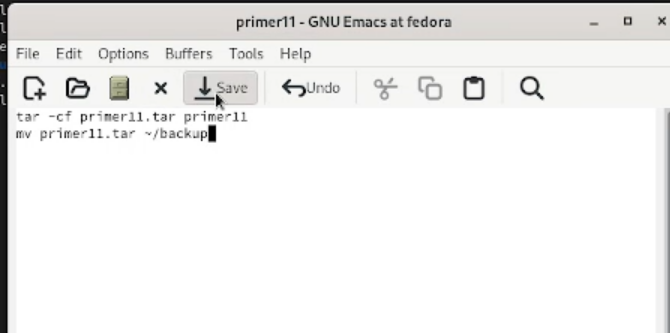
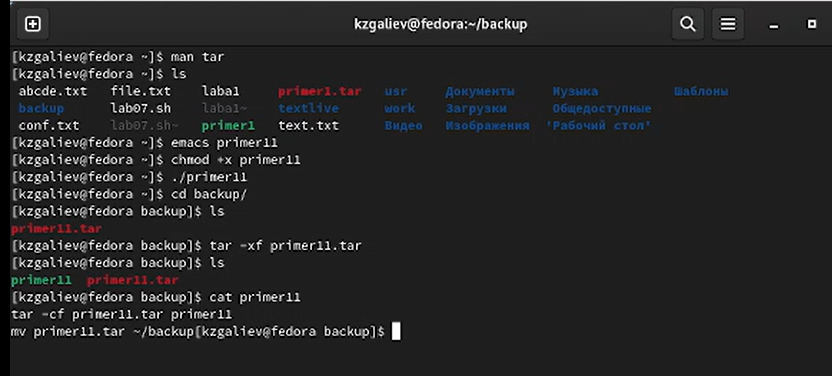
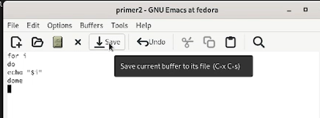
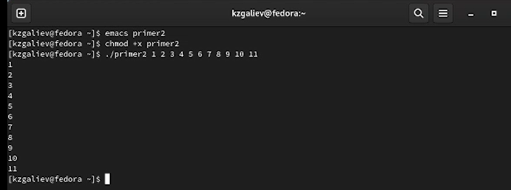
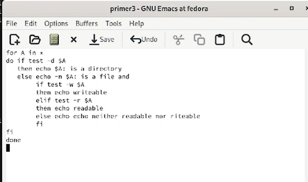
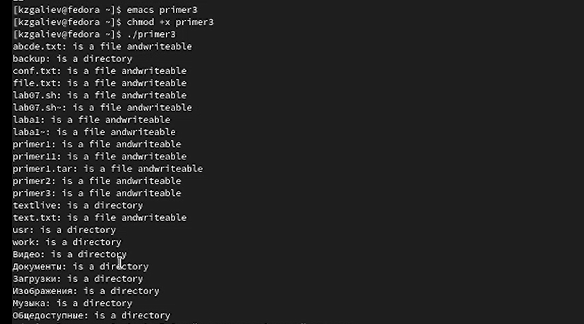
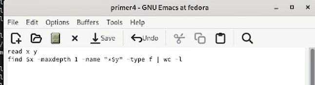
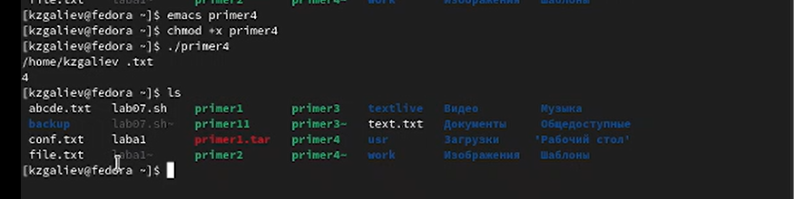

---
## Front matter
title: "Лабораторная работа №11"
subtitle: "Дисциплина: Операционные системы"
author: "Галиев Казиз Жарылкасымович"

## Generic otions
lang: ru-RU
toc-title: "Содержание"

## Bibliography
bibliography: bib/cite.bib
csl: pandoc/csl/gost-r-7-0-5-2008-numeric.csl

## Pdf output format
toc: true # Table of contents
toc-depth: 2
lof: true # List of figures
lot: true # List of tables
fontsize: 12pt
linestretch: 1.5
papersize: a4
documentclass: scrreprt
## I18n polyglossia
polyglossia-lang:
  name: russian
  options:
	- spelling=modern
	- babelshorthands=true
polyglossia-otherlangs:
  name: english
## I18n babel
babel-lang: russian
babel-otherlangs: english
## Fonts
mainfont: PT Serif
romanfont: PT Serif
sansfont: PT Sans
monofont: PT Mono
mainfontoptions: Ligatures=TeX
romanfontoptions: Ligatures=TeX
sansfontoptions: Ligatures=TeX,Scale=MatchLowercase
monofontoptions: Scale=MatchLowercase,Scale=0.9
## Biblatex
biblatex: true
biblio-style: "gost-numeric"
biblatexoptions:
  - parentracker=true
  - backend=biber
  - hyperref=auto
  - language=auto
  - autolang=other*
  - citestyle=gost-numeric
## Pandoc-crossref LaTeX customization
figureTitle: "Рис."
tableTitle: "Таблица"
listingTitle: "Листинг"
lofTitle: "Список иллюстраций"
lotTitle: "Список таблиц"
lolTitle: "Листинги"
## Misc options
indent: true
header-includes:
  - \usepackage{indentfirst}
  - \usepackage{float} # keep figures where there are in the text
  - \floatplacement{figure}{H} # keep figures where there are in the text
---

# Цель работы

Изучить основы программирования в оболочке ОС UNIX/Linux. Научиться писать небольшие командные файлы.

# Выполнение лабораторной работы

1. Написать скрипт, который при запуске будет делать резервную копию самого себя (то есть файла, в котором содержится его исходный код) в другую директорию backup в вашем домашнем каталоге (рис. @fig:001).

{#fig:001 width=70%}

В первой строке скрипта архивируем файл архиватором tar. Во второй строке перемещаем архив в каталог backup.

2. Делаем файл выполняемым, запускаем его и смотрим что получилось (рис. @fig:002).

{#fig:002 width=70%}

3. Написать пример командного файла, обрабатывающего любое произвольное число аргументов командной строки, в том числе превышающее десять (рис. @fig:003).

{#fig:003 width=70%}

Когда цикл for без списка значений, рн выполняется для всех позиционных параметров или, иначе говоря, аргументов.

4. Делаем файл выполняемым и запускаем его с одиннадцатью параметрами (рис. @fig:004).

{#fig:004 width=70%}

5. Написать командный файл — аналог команды ls (без использования самой этой команды и команды dir). Требуется, чтобы он выдавал информацию о нужном каталоге и выводил информацию о возможностях доступа к файлам этого каталога (рис. @fig:005).

{#fig:005 width=70%}

Первая строка в приведённом выше примере обеспечивает выполнение всех последующих действий в цикле для всех имён файлов из каталога. При этом переменная А на каждом шаге последовательно принимает значения, равные именам этих файлов. Первая содержащая служебное слово if строка проверяет, является ли файл, имя которого представляет собой текущее значение переменной А, каталогом. Если этот файл является каталогом, то на стандартный вывод выводятся имя этого файла и сообщение о том, что файл с указанным именем является каталогом. Эти действия в приведённом выше примере обеспечиваются в результате выполнения третьей строки.
Оставшиеся строки выполняются только в том случае, если проверка того, является ли файл, имя которого представляет собой текущее значение переменной А, каталогом, даёт отрицательный ответ. Это означает, что файл, имя которого представляет собой текущее значение переменной А, является обычным файлом. Если этот файл является обычным файлом, то на стандартный вывод выводятся имя этого файла и сообщение о том, что файл с указанным именем является обычным файлом. Эти действия в приведённом выше примере обеспечиваются в результате выполнения четвёртой строки. Особенностью использования команды echo в этой строке является использование флага -n, благодаря чему выводимая командой echo строка не будет дополнена символом newline (перевод строки), что позволяет впоследствии дополнить эту строку, как это, например, показано в приведённом выше примере. Вторая строка, содержащая служебное слово if, проверяет, доступен ли по записи файл, имя которого представляет собой текущее значение переменной А. Если этот файл доступен по записи, то строка дополняется соответствующим сообщением. Если же этот файл недоступен по записи, то проверяется, доступен ли этот файл по чтению. Эти действия в приведённом выше примере обеспечиваются в результате выполнения седьмой строки. Если этот файл доступен по чтению, то строка дополняется соответствующим сообщением. Если же этот файл недоступен ни по записи, ни по чтению, то строка также дополняется соответствующим сообщением.
Эти действия в приведённом выше примере обеспечиваются в результате выполнения девятой строки.

6. Делаем файл выполняемым и запускаем его в домашнем каталоге (рис. @fig:006).

{#fig:006 width=70%}

7. Написать командный файл, который получает в качестве аргумента командной строки формат файла (.txt, .doc, .jpg, .pdf и т.д.) и вычисляет количество таких файлов в указанной директории. Путь к директории также передаётся в виде аргумента командной строки (рис. @fig:007).

{#fig:007 width=70%}

При помощи команды read считываем сначала директорию, потом расширение. При помощи команды find ищем файлы. Команда wc -l подсчитывает количество строк, который содержит ввод в нее.

8. {#fig:008 width=70%}

# Выводы

В ходе выполнения лабораторной работы я изучил основы программирования в оболочке ОС UNIX/Linux и научился писать небольшие командные файлы.

# Контрольные вопросы

1. Объясните понятие командной оболочки. Приведите примеры командных оболочек. Чем они отличаются?

Командный процессор (командная оболочка, интерпретатор команд shell) — это программа, позволяющая пользователю взаимодействовать с операционной системой компьютера.
В операционных системах типа UNIX/Linux наиболее часто используются следующие реализации командных оболочек: – оболочка Борна (Bourne shell или sh) — стандартная командная оболочка UNIX/Linux, содержащая базовый, но при этом полный набор функций; – С-оболочка (или csh) — надстройка над оболочкой Борна, использующая подобный синтаксис команд с возможностью сохранения истории выполнения команд;– оболочка Корна (или ksh) — напоминает оболочку С, но операторы управления программой совместимы с операторами оболочки Борна; – BASH — сокращение от Bourne Again Shell (опять оболочка Борна), в основе своей совмещает свойства оболочек С и Корна (разработка компании Free Software Foundation).

2. Что такое POSIX?

POSIX (Portable Operating System Interface for Computer Environments) — набор стандартов описания интерфейсов взаимодействия операционной системы и прикладных программ. Стандарты POSIX разработаны комитетом IEEE (Institute of Electrical and Electronics Engineers) для обеспечения совместимости различных UNIX/Linuxподобных операционных систем и переносимости прикладных программ на уровне исходного кода. POSIX-совместимые оболочки разработаны на базе оболочки Корна.

3. Как определяются переменные и массивы в языке программирования bash?
Командный процессор bash обеспечивает возможность использования переменных типа строка символов. Имена переменных могут быть выбраны пользователем. Пользователь имеет возможность присвоить переменной значение некоторой строки символов.
Для создания массива используется команда set с флагом -A. За флагом следует имя переменной, а затем список значений, разделённых пробелами. Например,
 set -A states Delaware Michigan "New Jersey"
Далее можно сделать добавление в массив, например, states[49]=Alaska. Индексация массивов начинается с нулевого элемента.

4. Каково назначение операторов let и read?

Команда let является показателем того, что последующие аргументы представляют собой выражение, подлежащее вычислению. Команда let берет два операнда и присваивает их переменной. Положительным моментом команды let можно считать то, что для идентификации переменной ей не нужен знак доллара; вы можете писать команды типа let sum=x+7, и let будет искать переменную x и добавлять к ней 7.
read — это встроенная команда bash, которая считывает строку из стандартного ввода (или из файлового дескриптора) и разбивает строку на слова. Первое слово присваивается первому имени, второе — второму имени и так далее.

5. Какие арифметические операции можно применять в языке программирования bash?
Простейшими математическими выражениями являются сложение (+), вычитание (-), умножение (*), целочисленное деление (/) и целочисленный остаток от деления (%).

6. Что означает операция (( ))?
Команда let также расширяет другие выражения let, если они заключены в двойные круглые скобки. Таким способом вы можете создавать довольно сложные выражения. Команда let не ограничена простыми арифметическими выражениями.

7. Какие стандартные имена переменных Вам известны?
Значением переменной PATH (т.е. $РАТН) является список каталогов, в которых командный процессор осуществляет поиск программы или команды, указанной в командной строке, в том случае, если указанное имя программы или команды не содержит ни одного символа /. Если имя команды содержит хотя бы один символ /, то последовательность поиска, предписываемая значением переменной PATH, нарушается. В этом случае в зависимости от того, является имя команды абсолютным или относительным, поиск начинается соответственно от корневого или текущего каталога.
Переменные PS1 и PS2 предназначены для отображения промптера командного процессора. PS1 — это промптер командного процессора, по умолчанию его значение равно символу $ или #. Если какая-то интерактивная программа, запущенная командным процессором, требует ввода, то используется промптер PS2. Он по умолчанию имеет значение символа >.
Другие стандартные переменные:
–	HOME — имя домашнего каталога пользователя. Если команда cd вводится без аргументов, то происходит переход в каталог, указанный в этой переменной.
–	 – IFS — последовательность символов, являющихся разделителями в командной строке, например, пробел, табуляция и перевод строки (new line).
–	 – MAIL — командный процессор каждый раз перед выводом на экран промптера проверяет содержимое файла, имя которого указано в этой переменной, и если содержимое этого файла изменилось с момента последнего ввода из него, то перед тем как вывести на терминал промптер, командный процессор выводит на терминал сообщение You have mail (у Вас есть почта).
–	 – TERM — тип используемого терминала.
–	 – LOGNAME — содержит регистрационное имя пользователя, которое устанавливается автоматически при входе в систему.

8. Что такое метасимволы?
Такие символы, как ' < > * ? | \ " &, являются метасимволами и имеют для командного процессора специальный смысл.

9. Как экранировать метасимволы?

Снятие специального смысла с метасимвола называется экранированием метасимвола. Экранирование может быть осуществлено с помощью предшествующего метасимволу символа \, который, в свою очередь, является метасимволом. Для экранирования группы метасимволов нужно заключить её в одинарные кавычки. Строка, заключённая в двойные кавычки, экранирует все метасимволы, кроме $, ' , \, ". Например, – echo \* выведет на экран символ *, – echo ab’*\|*’cd выведет на экран строку ab*\|*cd.

10. Как создавать и запускать командные файлы?
Последовательность команд может быть помещена в текстовый файл. Такой файл называется командным. Далее этот файл можно выполнить по команде: bash командный_файл [аргументы].

11. Как определяются функции в языке программирования bash?

Группу команд можно объединить в функцию. Для этого существует ключевое слово function, после которого следует имя функции и список команд, заключённых в фигурные скобки. Удалить функцию можно с помощью команды unset c флагом -f.

12. Каким образом можно выяснить, является файл каталогом или обычным файлом?

 test -d file -истина, если file является каталогом.

13. Каково назначение команд set, typeset и unset?

Вы можете использовать команду set для вывода списка переменных окружения. Группу команд можно объединить в функцию. Для этого существует ключевое слово function, после которого следует имя функции и список команд, заключённых в фигурные скобки. Удалить функцию можно с помощью команды unset c флагом -f. Команда typeset имеет четыре опции для работы с функциями:
–	-f — перечисляет определённые на текущий момент функции;
–	– -ft — при последующем вызове функции инициирует её трассировку;
–	– -fx — экспортирует все перечисленные функции в любые дочерние программы оболочек;
–	 – -fu — обозначает указанные функции как автоматически загружаемые.

14. Как передаются параметры в командные файлы?

При вызове командного файла на выполнение параметры ему могут быть переданы точно таким же образом, как и выполняемой программе. С точки зрения командного файла эти параметры являются позиционными. Символ $ является метасимволом командного процессора. Он используется, в частности, для ссылки на параметры, точнее, для получения их значений в командном файле. В командный файл можно передать до девяти параметров. При использовании где-либо в командном файле комбинации символов $i, где 0 < i < 10, вместо неё будет осуществлена подстановка значения параметра с порядковым номером i, т.е. аргумента командного файла с порядковым номером i. Использование комбинации символов $0 приводит к подстановке вместо неё имени данного командного файла.

 15. Назовите специальные переменные языка bash и их назначение.

$1...$9 — Это так называемые позиционные параметры, служат для передачи сценарию оболочки аргументов командной строки. Если аргументов больше 9, то они должны заключаться в фигурные скобки, например ${12}.
•	$0 — Имя командной оболочки или запущенного сценария.
•	$# — Количество позиционных параметров, переданных сценарию.
•	$* — Позиционные параметры, начиная с первого. Когда $* указывается в двойных кавычках, значение переменной заменяется одним словом, содержащим значения каждого параметра, разделенных первым символом специальной переменной IFS.
•	$@ — Позиционные параметры, начиная с первого. Когда $@ указывается в двойных кавычках, то каждый параметр возвращается в отдельном слове.
•	$? — Код возврата последней команды.
•	$! — Возвращает идентификатор процесса последней команды, выполненной в фоновом режиме.
•	$$ — Номер процесса, под которым исполняется данный сценарий, очень удобно использовать в имени временного файла, чтобы сделать его уникальным.

# Список литературы{.unnumbered}

::: {#refs}
:::
