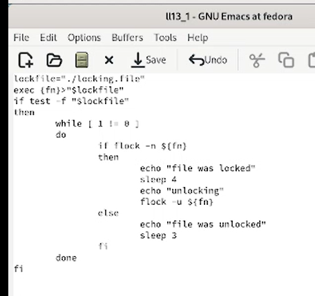
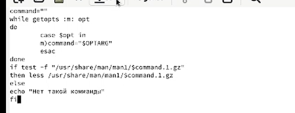
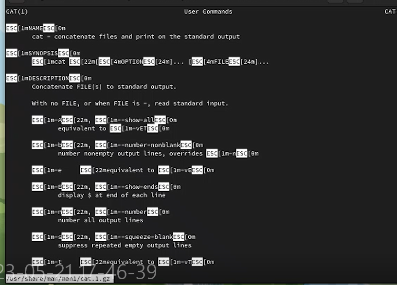

---
## Front matter
title: "Лбораторная работа №13"
subtitle: "Дисциплина: Операционные системы"
author: "Галиев Казиз Жарылкасымович"

## Generic otions
lang: ru-RU
toc-title: "Содержание"

## Bibliography
bibliography: bib/cite.bib
csl: pandoc/csl/gost-r-7-0-5-2008-numeric.csl

## Pdf output format
toc: true # Table of contents
toc-depth: 2
lof: true # List of figures
lot: true # List of tables
fontsize: 12pt
linestretch: 1.5
papersize: a4
documentclass: scrreprt
## I18n polyglossia
polyglossia-lang:
  name: russian
  options:
	- spelling=modern
	- babelshorthands=true
polyglossia-otherlangs:
  name: english
## I18n babel
babel-lang: russian
babel-otherlangs: english
## Fonts
mainfont: PT Serif
romanfont: PT Serif
sansfont: PT Sans
monofont: PT Mono
mainfontoptions: Ligatures=TeX
romanfontoptions: Ligatures=TeX
sansfontoptions: Ligatures=TeX,Scale=MatchLowercase
monofontoptions: Scale=MatchLowercase,Scale=0.9
## Biblatex
biblatex: true
biblio-style: "gost-numeric"
biblatexoptions:
  - parentracker=true
  - backend=biber
  - hyperref=auto
  - language=auto
  - autolang=other*
  - citestyle=gost-numeric
## Pandoc-crossref LaTeX customization
figureTitle: "Рис."
tableTitle: "Таблица"
listingTitle: "Листинг"
lofTitle: "Список иллюстраций"
lotTitle: "Список таблиц"
lolTitle: "Листинги"
## Misc options
indent: true
header-includes:
  - \usepackage{indentfirst}
  - \usepackage{float} # keep figures where there are in the text
  - \floatplacement{figure}{H} # keep figures where there are in the text
---

# Цель работы

 Изучить основы программирования в оболочке ОС UNIX. Научиться писать более сложные командные файлы с использованием логических управляющих конструкций и циклов.

# Выполнение лабораторной работы

1. Написать командный файл, реализующий упрощённый механизм семафоров. Командный файл должен в течение некоторого времени t1 дожидаться освобождения ресурса, выдавая об этом сообщение, а дождавшись его освобождения, использовать его в течение некоторого времени t2<>t1, также выдавая информацию о том, что ресурс используется соответствующим командным файлом (процессом). Запустить командный файл в одном виртуальном терминале в фоновом режиме, перенаправив его вывод в другой (> /dev/tty#, где # — номер терминала куда перенаправляется вывод), в котором также запущен этот файл, но не фоновом, а в привилегированном режиме. Доработать программу так, чтобы имелась возможность взаимодействия трёх и более процессов (рис. @fig:001) .

{#fig:001 width=70%}

Выполним первый скрипт (рис. @fig:002) .

{#fig:002 width=70%}

2. Реализовать команду man с помощью командного файла. Изучите содержимое каталога /usr/share/man/man1. В нем находятся архивы текстовых файлов, содержащих справку по большинству установленных в системе программ и команд. Каждый архив можно открыть командой less сразу же просмотрев содержимое справки. Командный файл должен получать в виде аргумента командной строки название команды и в виде результата выдавать справку об этой команде или сообщение об отсутствии справки, если соответствующего файла нет в каталоге man1 .

Изучаем каталог /usr/share/man/man1 (рис. @fig:003) .

{#fig:003 width=70%}

Напишем второй скрипт (рис. @fig:004) .

{#fig:004 width=70%}

Запустим второй скрипт (рис. @fig:005) , (рис. @fig:006) .

{#fig:005 width=70%}

{#fig:006 width=70%}

3. Используя встроенную переменную $RANDOM, напишите командный файл, генерирующий случайную последовательность букв латинского алфавита. Учтите, что $RANDOM выдаёт псевдослучайные числа в диапазоне от 0 до 32767.

Напишем третий скрипт (рис. @fig:007) .

{#fig:007 width=70%}

Запустим третий скрипт (рис. @fig:008) .

{#fig:008 width=70%}

# Выводы

В результате лабораторной работы я изучил основы программирования в оболочке ОС UNIX и научился писать более сложные командные файлы с использованием логических управляющих конструкций и циклов.

# Контрольные вопросы

1. Найдите синтаксическую ошибку в следующей строке:
 while [$1 != "exit"] 
 
Между открывающейся скобкой и $ нужен пробел, и между “ и закрывающейся скобкой нужен пробел.

2. Как объединить (конкатенация) несколько строк в одну? 

Самый простой способ объединить две или более строковые переменные — записать их одну за другой, при этом перед первой переменной поставить $ и перед второй тоже, взять все переменные в кавычки.

3. Найдите информацию об утилите seq. Какими иными способами можно реализовать её функционал при программировании на bash? 

seq — утилита, используемая в unix-системах для генерации последовательности. Дополнительные возможности утилиты — указание начального значения, инкремента (в том числе числа с плавающей запятой), форматирования вывода. Стала использоваться реже с распространением таких альтернатив, как expr, и с появлением в командных интерпретаторах числового перебора в циклах.

4. Какой результат даст вычисление выражения $((10/3))? 

Конструкция ((…)) позволяет работать с целыми числами, поэтому результат 3!

5. Укажите кратко основные отличия командной оболочки zsh от bash. 

Все оболочки имеют много общего, так как они относятся к одному стандарту.
Разница в графике, в удобстве использования, в мелочах. Они могут быть установлены на один компьютер одновременно. Bash занимает намного больше памяти, так имеет графику. Bash подсвечивает наименования файлов, чтобы легче было ориентироваться.

6. Проверьте, верен ли синтаксис данной конструкции for ((a=1; a <= LIMIT; a++)) 

Верен.

7. Сравните язык bash с какими-либо языками программирования. Какие преимущества у bash по сравнению с ними? Какие недостатки?

Bash (Bourne Again Shell)
Наиболее часто используемая командная оболочка по умолчанию в операционных системах GNU/Linux. Она включает в себя простой язык программирования, который позволяет при помощи условных операторов и операторов цикла использовать утилиты и программы операционной системы для написания как простых, так и сложных скриптов. 
В этом плане Bash, несомненно, обладает некоторыми преимуществами, в частности, универсальностью и доступностью. Для того, чтобы написать скрипт на Bash, установка дополнительных пакетов не требуется. Достаточно создать файл вида script_name.sh с последовательно исполняемыми операциями и запустить его, либо добавить в качестве задачи планировщика cron. 
Вот далеко не полный список задач, которые можно решить с использованием bash-скрипта: – вывод нескольких последних строк лога или поиск и выборка ключевых слов с последующим сохранением в отдельный файл; – архивирование каталога с данными с последующей отправкой архива на удаленный компьютер по ssh или telnet; – настройка системы бэкапа файлов базы данных с использованием дампинга; – запрос информации о конфигурации нескольких компьютеров в сети и отправка файла с результатами по e-mail; – поиск дубликатов файлов на диске с последующим выводом списка имен и запросом на удаление; – рекурсивная замена владельцев отдельных файлов и каталогов на диске.
Стоит отметить, что возможности командного интерпретатора зачастую используются не полностью. Многие администраторы выбирают Bash для написания простых или средних по сложности скриптов. В крупных проектах, где есть специфические задачи и требуется работа с разнообразными входными данными, многомерными массивами и сокетами больше доверяют Perl, Python или Ruby. 
Отчасти это связано с проблемами переносимости bash-скриптов на другие платформы, (например, Windows), отчасти с тем, что Bash воспринимается скорее как средство автоматизации работы с файлами и утилитами, чем полноценный скриптовый язык, даже несмотря на наличие в арсенале sed и awk. Ещё одним минусом Bash является то, что при выполнении скрипта каждая запущенная с его помощью утилита создаёт свой процесс, что отражается на скорости выполнения и уровне использования ресурсов системы. 
Python
В отличие от Bash, Python является полноценным объектно-ориентированным языком программирования. Он входит в состав большинства распространенных дистрибутивов GNU/Linux, что позволяет использовать его в качестве альтернативной основы для написания скриптов, решающих задачи системного администрирования. Вот лишь несколько причин, по которым выбор нередко падает на Python:
Удобочитаемость и компактность кода Благодаря соблюдению чётких синтаксических правил, скрипт, написанный на Python, будет понятен любому IT-специалисту, знакомому с программированием, даже если он видит этот код впервые. В то же время, при внесении изменений следует обращать внимание на правильную расстановку отступов – в Python они используются в качестве разграничителей блоков кода.
Наличие (даже в стандартной комплектации) большого количества модулей, подключаемых с помощью оператора import Каждый из модулей состоит из набора функций и методов, которые поддерживают основные системные протоколы и форматы и легко используются при написании собственного кода. Таким образом, экономится время, а скрипт будет выглядеть более структурированным. Возможности Python также позволяют написать и подключить собственный модуль, если поставленная задача отличается специфичностью решения;
Кроссплатформенность Скрипты Python работают и в среде Windows, и в MacOS, и в UNIX, включая FreeBSD и GNU/Linux. Этот язык широко используется и на мобильных платформах, таких как Symbian, Android. В этом преимущество Python. Bash такими возможностями не обладает и является «встроенным» инструментарием только для семейств _NIX, _BSD и GNU/Linux. Скрипт, однажды написанный на Python, с большой долей вероятности будет работать на разных платформах, решая схожие задачи, при условии, что код не будет содержать специфических для конкретной операционной системы функций.
Python является подходящим инструментарием для решения следующих задач администрирования: – парсинг лога или конфигурационного файла с использованием регулярных выражений; – разработка приложений, в том числе нестандартных, для работы с базами данных MySQL, Oracle, PostgreSQL, Sybase и др.; – сбор и анализ статистики интернет-трафика с нескольких IP-адресов; – преобразование данных в различные форматы, например, конвертация .ini-файлов в текст при помощи модуля ConfigParser; – работа с файлами сервера при помощи FTP-клиента; – поднятие простого прокси-сервера; – мониторинг работоспособности сервиса, запущенного на сервере, с отправкой предупреждений на e-mail администратора в случае сбоя; – поднятие ppp-соединения с использованием программы автодозвона; – поиск дубликатов с запросом на удаление или перемещение в каталоге с большим количеством файлов; – проверка целостности архивов бэкапа при помощи алгоритма md5; – и т.д.
Вывод
Python – удобный инструмент для решения задач системного администрирования, как повседневных, так и более специфических. Он одинаково подходит для создания как скриптов, так и более сложных приложений, в особенности сетевых, а также может служить заменой стандартному shell в Linux. 
Так как Python является полноценным скриптовым языком, предпочтение в его использовании отдаётся специфическим задачам или тем, для решения которых возможностей Bash недостаточно. В решении же повседневных задач выбор нередко падает на Bash по причине его универсальности и доступности. Однако преимущество Python в его удобстве и большей функциональности. 
Безусловно, для опытного системного администратора написать 300 строк на Bash – не проблема. Особенно, если он потом не будет их читать. Но для специалиста, которому необходимо быстро понять и исправить проблему, это настоящая головная боль. 

# Список литературы{.unnumbered}

::: {#refs}
:::
