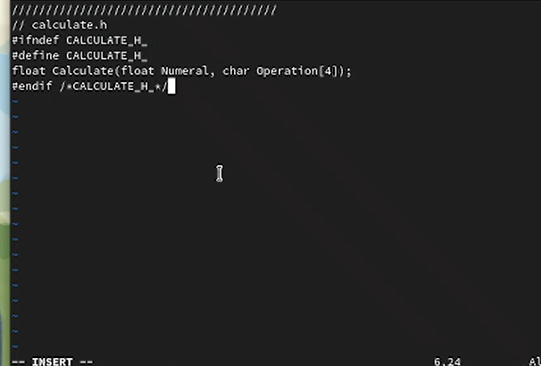
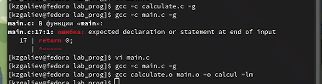

---
## Front matter
title: "Лабораторная работа №14"
subtitle: "Дисциплина: Операционные системы"
author: "Галиев Казиз Жарылкасымович"

## Generic otions
lang: ru-RU
toc-title: "Содержание"

## Bibliography
bibliography: bib/cite.bib
csl: pandoc/csl/gost-r-7-0-5-2008-numeric.csl

## Pdf output format
toc: true # Table of contents
toc-depth: 2
lof: true # List of figures
lot: true # List of tables
fontsize: 12pt
linestretch: 1.5
papersize: a4
documentclass: scrreprt
## I18n polyglossia
polyglossia-lang:
  name: russian
  options:
	- spelling=modern
	- babelshorthands=true
polyglossia-otherlangs:
  name: english
## I18n babel
babel-lang: russian
babel-otherlangs: english
## Fonts
mainfont: PT Serif
romanfont: PT Serif
sansfont: PT Sans
monofont: PT Mono
mainfontoptions: Ligatures=TeX
romanfontoptions: Ligatures=TeX
sansfontoptions: Ligatures=TeX,Scale=MatchLowercase
monofontoptions: Scale=MatchLowercase,Scale=0.9
## Biblatex
biblatex: true
biblio-style: "gost-numeric"
biblatexoptions:
  - parentracker=true
  - backend=biber
  - hyperref=auto
  - language=auto
  - autolang=other*
  - citestyle=gost-numeric
## Pandoc-crossref LaTeX customization
figureTitle: "Рис."
tableTitle: "Таблица"
listingTitle: "Листинг"
lofTitle: "Список иллюстраций"
lotTitle: "Список таблиц"
lolTitle: "Листинги"
## Misc options
indent: true
header-includes:
  - \usepackage{indentfirst}
  - \usepackage{float} # keep figures where there are in the text
  - \floatplacement{figure}{H} # keep figures where there are in the text
---

# Цель работы

 Приобрести простейшие навыки разработки, анализа, тестирования и отладки приложений в ОС типа UNIX/Linux на примере создания на языке программирования С калькулятора с простейшими функциями.

# Выполнение лабораторной работы

1. В домашнем каталоге создаем подкаталог ~ work/os/lab_prog (рис. @fig:001) .

{#fig:001 width=70%}

2. Создаем файл calculate.c (рис. @fig:002) .

{#fig:002 width=70%}

3. продолжение файла  calculate.c (рис. @fig:003) .

{#fig:003 width=70%}

4. продолжение файла  calculate.c (рис. @fig:004) .

{#fig:004 width=70%}

5. Создадим файл calculate.h (рис. @fig:005) .

{#fig:005 width=70%}

6. Создадим файл main.c (рис. @fig:006) .

{#fig:006 width=70%}

7. Выполним компиляцию программы посредством gcc (рис. @fig:007) .

{#fig:007 width=70%}

8. Создадим Makefile (рис. @fig:008) .

{#fig:008 width=70%}

9. Запустим отладчик и программу внутри отладчика (run) (рис. @fig:009) .

{#fig:009 width=70%}

10. Выполним программу (рис. @fig:010) .

{#fig:010 width=70%}

11. Просмотрим исходную программу (list), просмотрим строки  с 12 по 15 (рис. @fig:011) .

{#fig:011 width=70%}

12. Просмотрим определенные строки не основного файла, установим точку останова 21 строке (рис. @fig:012) .

{#fig:012 width=70%}

13. Выведем информацию об имеющихся в проекте точках останова (рис. @fig:013) .

{#fig:013 width=70%}

14. Запустим программу внутри отладчика и убедимся, что программа остановилась в момент прохождения точки останова (рис. @fig:014) .

{#fig:014 width=70%}

15. Посмотрим, чему равно на этом этапе значение переменной Numeral разными способами, уберем точку останова
(рис. @fig:015) .

{#fig:015 width=70%}

16. Проанализируем программный код с помощью утилиты splint (рис. @fig:016) .

{#fig:016 width=70%}

# Выводы

 В результате лабораторной работы я приобрел простейшие навыки разработки, анализа, тестирования и отладки приложений в ОС типа UNIX/Linux на примере создания на языке программирования C калькултора с простейшими функциями.
 
# Контрольные вопросы

1. Как получить информацию о возможностях программ gcc, make, gdb и др.?

Более подробную информацию по работе с gdb можно получить с помощью команд gdb -h и man gdb.

 2. Назовите и дайте краткую характеристику основным этапам разработки приложений в UNIX.
Процесс разработки программного обеспечения обычно разделяется на следующие этапы:
– планирование, включающее сбор и анализ требований к функционалу и другим характеристикам разрабатываемого приложения;
– проектирование, включающее в себя разработку базовых алгоритмов и спецификаций, определение языка программирования;
– непосредственная разработка приложения:
– кодирование — по сути создание исходного текста программы (возможно в нескольких вариантах);
– анализ разработанного кода;
– сборка, компиляция и разработка исполняемого модуля;
– тестирование и отладка, сохранение произведённых изменений;
– документирование.

 3. Что такое суффикс в контексте языка программирования? Приведите примеры использования.

Файлы с расширением (суффиксом) .c воспринимаются gcc как программы на языке С, файлы с расширением .cc или .C — как файлы на языке C++, а файлы c расширением .o считаются объектными.

4. Каково основное назначение компилятора языка С в UNIX?
Компилятор — это программа, которая переводит текст, написанный на языке программирования, в машинные коды. С помощью компиляторов компьютеры могут понимать разные языки программирования, в том числе высокоуровневые, то есть близкие к человеку и далекие от «железа». Процесс работы компилятора с кодом называется компиляцией, или сборкой. По сути, компилятор — комплексный «переводчик», который собирает, или компилирует, программу в исполняемый файл. Исполняемый файл — это набор инструкций для компьютера, который тот понимает и может выполнить.
5. Для чего предназначена утилита make?

Она позволяет автоматизировать процесс преобразования файлов программы из одной формы в другую, отслеживает взаимосвязи между файлами.

6. Приведите пример структуры Makefile. Дайте характеристику основным элементам этого файла.

 
Сначала задаётся список целей, разделённых пробелами, за которым идёт двоеточие и список зависимостей. Затем в следующих строках указываются команды. Строки с командами обязательно должны начинаться с табуляции. В качестве цели в Makefile может выступать имя файла или название какого-то действия. Зависимость задаёт исходные параметры (условия) для достижения указанной цели. Зависимость также может быть названием какого-то действия. Команды — собственно действия, которые необходимо выполнить для достижения цели.

7. Назовите основное свойство, присущее всем программам отладки. Что необходимо сделать, чтобы его можно было использовать?

Во время работы над кодом программы программист неизбежно сталкивается с появлением ошибок в ней. Использование отладчика для поиска и устранения ошибок в программе существенно облегчает жизнь программиста. В комплект программ GNU для ОС типа UNIX входит отладчик GDB (GNU Debugger). Для использования GDB необходимо скомпилировать анализируемый код программы таким образом, чтобы отладочная информация содержалась в результирующем бинарном файле. Для этого следует воспользоваться опцией -g компилятора gcc: gcc -c file.c -g После этого для начала работы с gdb необходимо в командной строке ввести одноимённую команду, указав в качестве аргумента анализируемый бинарный файл: gdb file.o Затем можно использовать по мере необходимости различные команды gdb.

8. Назовите и дайте основную характеристику основным командам отладчика gdb.
backtrace вывод на экран пути к текущей точке останова (по сути вывод названий всех функций)
break установить точку останова (в качестве параметра может быть указан номер строки или название функции)
clear удалить все точки останова в функции
continue продолжить выполнение программы
delete удалить точку останова
display добавить выражение в список выражений, значения которых отображаются при достижении точки останова программы
finish выполнить программу до момента выхода из функции
 info breakpoints вывести на экран список используемых точек останова info watchpoints вывести на экран список используемых контрольных выражений
list вывести на экран исходный код (в качестве параметра может быть указано название файла и через двоеточие номера начальной и конечной строк)
next выполнить программу пошагово, но без выполнения вызываемых в программе функций
print вывести значение указываемого в качестве параметра выражения run запуск программы на выполнение
set установить новое значение переменной
step пошаговое выполнение программы
watch установить контрольное выражение, при изменении значения которого программа будет остановлена

9. Опишите по шагам схему отладки программы, которую Вы использовали при выполнении лабораторной работы.
–	Запустите отладчик GDB, загрузив в него программу для отладки:
 gdb ./calcul
–	 Для запуска программы внутри отладчика введите команду run:
run
–	 Для постраничного (по 9 строк) просмотра исходного код используйте команду list:
list
–	 Для просмотра строк с 12 по 15 основного файла используйте list с параметрами:
list 12,15
–	 Для просмотра определённых строк не основного файла используйте list с параметрами:
 list calculate.c:20,29
–	 Установите точку останова в файле calculate.c на строке номер 21:
 list calculate.c:20,27
break 21
–	 Выведите информацию об имеющихся в проекте точка останова:
info breakpoints
–	 Запустите программу внутри отладчика и убедитесь, что программа остановится в момент прохождения точки останова:
 run
5
-
backtrace
– Посмотрите, чему равно на этом этапе значение переменной Numeral, введя:
 print Numeral
display Numeral
–	 Уберите точки останова:
 info breakpoints
 delete 1

10. Назовите основные средства, повышающие понимание исходного кода программы.
Если вы работаете с исходным кодом, который не вами разрабаты-
вался, то назначение различных конструкций может быть не совсем понятным. Система разработки приложений UNIX предоставляет различные средства, повышающие понимание исходного кода. К ним относятся:
– cscope - исследование функций, содержащихся в программе;
– lint — критическая проверка программ, написанных на языке Си.

11. Каковы основные задачи, решаемые программой splint?
Эта утилита анализирует программный код, проверяет корректность задания аргументов использованных в программе функций и типов возвращаемых значений, обнаруживает синтаксические и семантические ошибки. В отличие от компилятора C анализатор splint генерирует комментарии с описанием разбора кода программы и осуществляет общий контроль, обнаруживая такие ошибки, как одинаковые объекты, определённые в разных файлах, или объекты, чьи значения не используются в работе программы, переменные с некорректно заданными значениями и типами и много другого.

# Список литературы{.unnumbered}

::: {#refs}
:::
