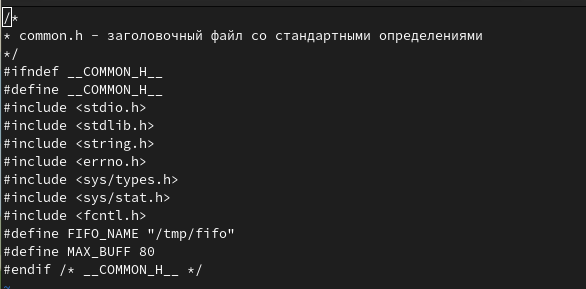
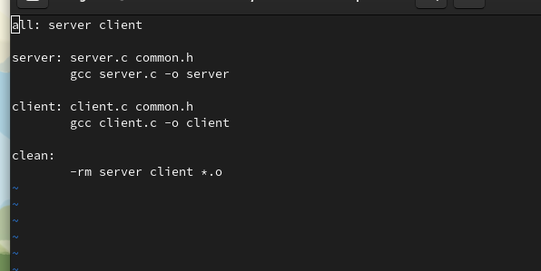
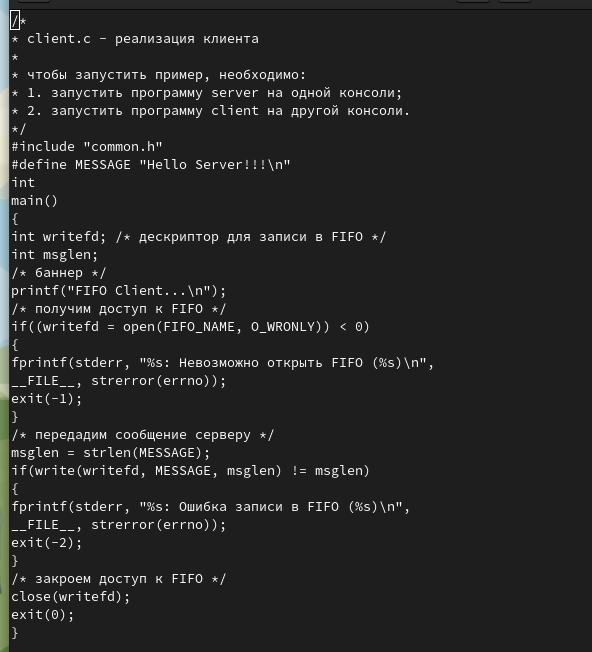
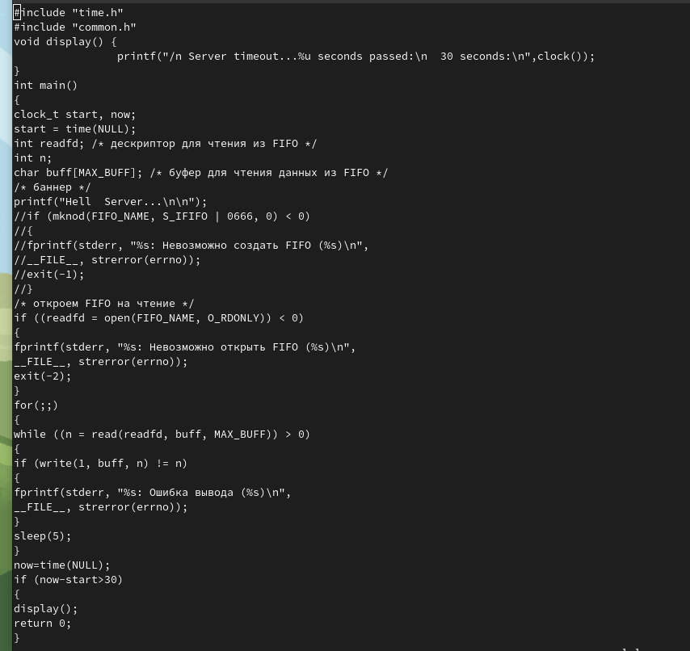
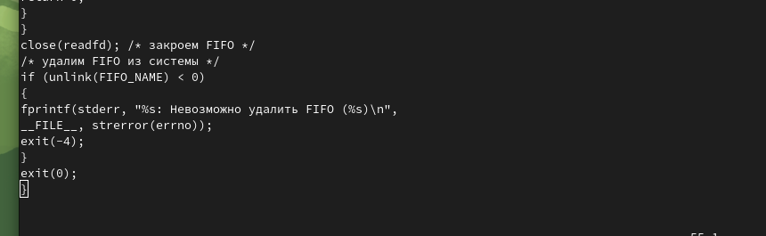
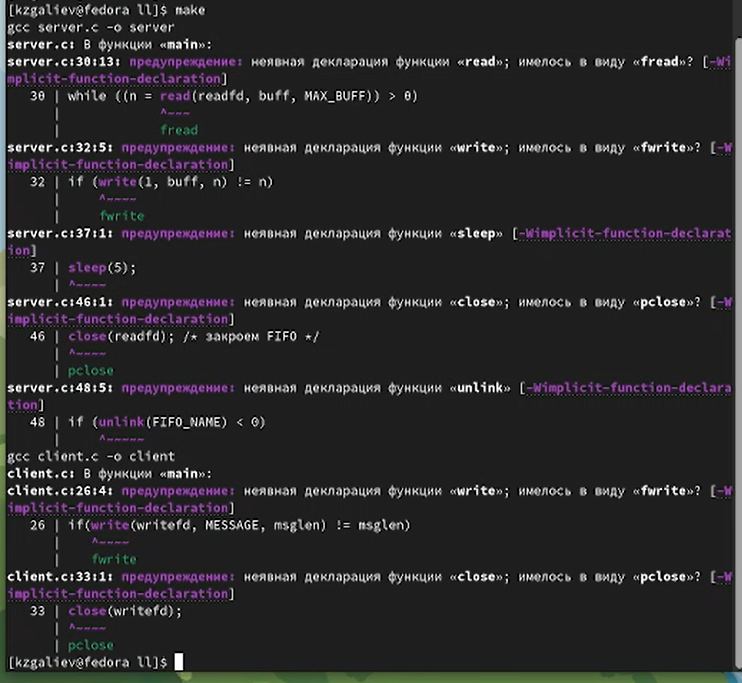
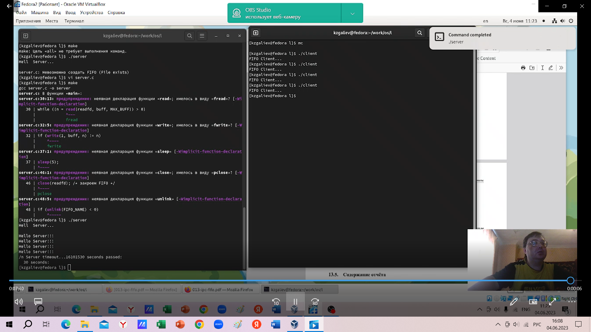

---
## Front matter
title: "Лабораторная работа №15"
subtitle: "Дисциплина: Операционные системы"
author: "Галиев Казиз Жарылкасымович"

## Generic otions
lang: ru-RU
toc-title: "Содержание"

## Bibliography
bibliography: bib/cite.bib
csl: pandoc/csl/gost-r-7-0-5-2008-numeric.csl

## Pdf output format
toc: true # Table of contents
toc-depth: 2
lof: true # List of figures
lot: true # List of tables
fontsize: 12pt
linestretch: 1.5
papersize: a4
documentclass: scrreprt
## I18n polyglossia
polyglossia-lang:
  name: russian
  options:
	- spelling=modern
	- babelshorthands=true
polyglossia-otherlangs:
  name: english
## I18n babel
babel-lang: russian
babel-otherlangs: english
## Fonts
mainfont: PT Serif
romanfont: PT Serif
sansfont: PT Sans
monofont: PT Mono
mainfontoptions: Ligatures=TeX
romanfontoptions: Ligatures=TeX
sansfontoptions: Ligatures=TeX,Scale=MatchLowercase
monofontoptions: Scale=MatchLowercase,Scale=0.9
## Biblatex
biblatex: true
biblio-style: "gost-numeric"
biblatexoptions:
  - parentracker=true
  - backend=biber
  - hyperref=auto
  - language=auto
  - autolang=other*
  - citestyle=gost-numeric
## Pandoc-crossref LaTeX customization
figureTitle: "Рис."
tableTitle: "Таблица"
listingTitle: "Листинг"
lofTitle: "Список иллюстраций"
lotTitle: "Список таблиц"
lolTitle: "Листинги"
## Misc options
indent: true
header-includes:
  - \usepackage{indentfirst}
  - \usepackage{float} # keep figures where there are in the text
  - \floatplacement{figure}{H} # keep figures where there are in the text
---

# Цель работы

Приобретение практических навыков работы с именованными каналами.

# Выполнение лабораторной работы

1. Создадим файл common.h (рис. @fig:001).

{#fig:001 width=70%}

2. Создадим файл Makefile (рис. @fig:002).

{#fig:002 width=70%}

3. Создадим файл client.c (рис. @fig:003).

{#fig:003 width=70%}

4. Внесем изменения в файл server.c (рис. @fig:004), (рис. @fig:005).

{#fig:004 width=70%}

{#fig:005 width=70%}

5. Выполнение утилиты make (рис. @fig:006).

{#fig:006 width=70%}

6. Выполнение программы на двух терминалах (рис. @fig:007).

{#fig:007 width=70%}

# Выводы

В ходе выполнения лабораторной работы я приобре практические навыки работы с именованными каналами.

# Контрольные вопросы

1. В чем ключевое отличие именованных каналов от неименованных?

Для передачи данных между неродственными процессами можно использовать механизм именованных каналов (named pipes). Данные передаются по принципу FIFO (First In First Out) (первым записан — первым прочитан), поэтому они называются также FIFO pipes или просто FIFO. Именованные каналы отличаются от неименованных наличием идентификатора канала, который представлен как специальный файл (соответственно имя именованного канала — это имя файла).
 
2. Возможно ли создание неименованного канала из командной строки?

 Для создания неименованного канала используется системный вызов pipe. Массив из двух целых чисел является выходным параметром этого системного вызова. Если вызов выполнился нормально, то массив содержит два файловых дескриптора: для чтения информации из канала и для записи в него соответственно. Когда процесс порождает другой процесс, дескрипторы родителя наследуются дочерним процессом, и, таким образом, осуществляется связь между двумя процессами. Один из них использует канал только для чтения, а другой — только для записи. Поэтому, если, например, через канал должны передаваться данные из родительского процесса в дочерний, родительский процесс сразу после запуска дочернего процесса закрывает дескриптор канала для чтения, а дочерний процесс закрывает дескриптор для записи. Если нужен двунаправленный обмен данными, то родительский процесс создает два канала, один из которых используется для передачи данных в одну сторону, а другой — в другую.

3. Возможно ли создание именованного канала из командной строки?

Можете создавать именованные каналы из командной строки и внутри программы. С давних времен программой создания их в командной строке была команда: mknod ($ mknod имя файла р)
Однако команды mknod нет в списке команд X/Open, поэтому она включена не во все UNIX-подобные системы. Предпочтительнее применять в командной строке $ mkfifo имя файла. 

4. Опишите функцию языка С, создающую неименованный канал.

Неименованный канал создается вызовом pipe, который заносит в массив int [2] два дескриптора открытых файлов. fd[0] – открыт на чтение, fd[1] – на запись (вспомните STDIN == 0, STDOUT == 1). Канал уничтожается, когда будут закрыты все файловые дескрипторы, ссылающиеся на него.

5. Опишите функцию языка С, создающую именованный канал. 

Именованный канал FIFO доступен как объект в файловой системе. При этом, до открытия объекта FIFO на чтение, собственно коммуникационного объекта не создаётся. После открытия открытия объекта FIFO в одном процессе на чтение, а в другом на запись, возникает ситуация полностью эквивалентная использованию неименованного канала. Объект FIFO в файловой системе создаётся вызовом функции int mkfifo(const char *pathname, mode_t mode);, Основное отличие между pipe и FIFO - то, что pipe могут совместно использовать только процессы, находящиеся в отношении родительский-дочерний, а FIFO может использовать любая пара процессов.

6. Что будет в случае прочтения из fifo меньшего числа байтов, чем находится в канале? Большего числа байтов? 

При чтении числа байт, меньшего чем находится в канале, возвращается требуемое число байтов, остаток сохраняется для последующих чтений. При чтении числа байт, большего чем находится в канале, возвращается доступное число байт.

7. Аналогично, что будет в случае записи в fifo меньшего числа байтов, чем позволяет буфер? Большего числа байтов? 

Запись числа байт меньше чем PIPE_BUF выполняется атомарно. При записи из нескольких процессов данные не перемешиваются. При записи числа байт больше чем PIPE_BUF атомарность операции не гарантируется.

8. Могут ли два и более процессов читать или записывать в канал? 

С точки зрения процессов, канал выглядит как пара открытых файловых дескрипторов – один на чтение и один на запись (можно больше, но неудобно). Мы можем писать в канал до тех пор, пока есть место в буфере, если место в буфере кончится – процесс будет заблокирован на записи.

9. Опишите функцию write (тип возвращаемого значения, аргументы и логику работы). Что означает 1 (единица) в вызове этой функции в программе server.c (строка 42)?

Для записи информации в канал используется системный вызов write. Для чтения информации из канала — системный вызов read. Первый аргумент этих вызовов — дескриптор канала, имеющий тип int, второй — указатель на область памяти, с которой происходит обмен, имеет тип void, третий — количество байт, целочисленный тип. Оба вызова возвращают число переданных байт (либо значение «-1» при ошибке). При завершении использования канала процесс выполняет системный вызов close.

 10. Опишите функцию strerror.
Строковая функция strerror - функция языков C/C++, транслирующая код ошибки, который обычно хранится в глобальной переменной errno, в сообщение об ошибке, понятное человеку.

# Список литературы{.unnumbered}

::: {#refs}
:::
